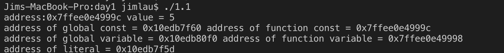

# C++ day1

## 1.const关键字与宏定义的区别是什么

> 区别在于宏定义属于立即数，`const`关键字在全局中与立即数位于相同的地址空间，是无法访问的代码区，如果强制转换，则会造成程序运行崩溃。

```cpp
#include <iostream>
using std::cout;
using std::cin;
using std::endl;
#define DEM "ax"
const int AX = 10;
int AY;
int main(const int argc, const char **argv)
{
    const int x = 5;
    int y = 10;
    const int * p = &AX;
    int * ptr = (int *)p;
    *ptr = 11;
    cout<<"address:"<<&AX<<" value = "<<*p;
    cout<<"address of global const = "<<&AX<<" address of function const = "<<&x<<endl;
    cout<<"address of global variable = "<<&AY<<" address of function variable = "<<&y<<endl;
    cout<<"address of literal = "<<&DEM<<endl;
    return 0;
}
```

运行结果：


> 而`const`关键字还存在更多的用法：比如修饰引用、指针复合类型，在函数中用于保护常量，尽管变量仍处于函数栈空间，而受到保护编译器会报错
修改代码如下：

```cpp
    int * p = &x;
    *p = 11;
    cout<<"address:"<<&x<<" value = "<<x;
```

则得到编译错误：


> 然而强转后仍然能够进行赋值操作：

```cpp
    int * p = (int *)&x;
    *p = 11;
    cout<<"address:"<<&x<<" value = "<<x<<endl;
```

运行结果如下：



## 2. 引用与指针的区别是什么

> 引用在函数中可以直接使用原来的传入实参作为实体进行操作，使用上类似于变量的别名，比起指针的使用，不需要解引用，更加方便。
> 然而在`Cpp`底层实现当中，引用就是指针来实现的，因而二者没有本质上的区别，只是语法上`Cpp`的引用提供了方便。

## 3. malloc的底层实现是怎样的？free是怎么回收内存的

虚拟内存中的堆空间向上增长，维护一个指向堆顶的brk指针，分配器分为显示分配器和隐式分配器。C/C++中使用的都是显示分配器，隐式分配器又称为垃圾收集器，在Java、Lisp等语言中使用。


1. 使用`sbrk`接口可以对brk指针进行偏移，incr为偏移量且可以为负，返回brk指针的旧值。

```cxx
void *sbrk(intptr_t incr);
```

2. 维护一个空闲链表标记每一个空闲块或者占用块的大小，如果通过在每个分配块的开始添加头部信息的方式使整个堆空间形成一个空闲链表，则每次查找空闲块都需要遍历这个空闲，时间复杂度呈线性。


3. 对于空闲链表的操作有放置分配块、分割空闲块、合并空闲块、获取额外的堆内存的操作。分配块有首次适配、下一次适配和最佳适配的方式。分割空闲块就是将内存块切割为需要大小的分配块。合并空闲块可以立即合并是释放一次就合并，也可以推迟合并。获取额外的堆内存需要调用`sbrk`函数向内核请求额外的堆内存。

## 4. new/delete与malloc/free的区别是什么

1. malloc/free是C/C++语言的标准库函数，new/delete是C++的运算符或表达式；
2. new能够自动分配空间大小，malloc需要传入参数；
3. new开辟空间的同时还对空间做了初始化的操作，而malloc不行；
4. new/delete能进行对对象进行构造和析构函数的调用，进而对内存进行更加详细的工作，而malloc/free不能。

## 5. inline函数与带参数的宏定义的区别

宏定义由预编译器进行替换，`inline`函数在编译器中进行函数类型、变量检查之后再行替换。基于这一点，`inline`函数具有以下优势：

> `inline`函数可以进行调试，因为在编译后可以为其函数体专门生成调试二进制代码
> `Cpp`编译器进行了`inline`函数格式检查、语法检查，使用比宏定义更安全，而宏定义易于出现意想不到的错误
> `inline`函数可以访问类的私有成员，宏定义无法预知将在哪个类使用

## [code] 1. 当天所写代码尽量实现一遍，多做测试

## [code] 2. 预习类和对象的内容
