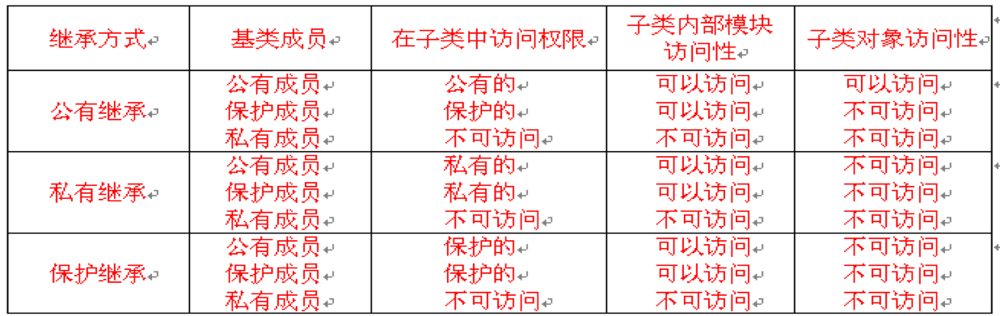

# day10

## 继承简答题

### 1. 三种继承方式对于基类成员的访问权限是怎样的

> `public`：派生类可访问基类`public`、`protected`成员，并且不改变其在派生类的权限  
> `protected`：派生类可访问基类`public`、`protected`成员，并且将两者置为`protected`成员，在派生类定义中可以访问，在对象中不可访问  
> `private`：派生类可访问基类`public`、`protected`成员，并且将二者置为`private`成员，在派生类定义中可以访问，在对象中不可访问

### 2. 继承中有哪些内容是不能进行继承的

> 友元函数  
> 构造函数、析构函数  
> 重载的`new/delete`、`=`赋值成员函数

### 3. 多基派生会产生的问题有哪些？怎样解决

> 可能会出现钻石型继承，需要定义为虚继承处理  
> 成员名二义性的问题，需要限定作用域

### 4. 派生类对象之间的复制控制规则是什么

> 派生类对象构造函数递归地向上调用基类构造函数，尤其在带参数构造函数中需要显式调用基类带参构造函数，然后执行自己的初始化过程  
> 派生类对象析构函数递归地调用基类的析构函数，先进行派生类析构函数销毁，再进行基类析构函数销毁  
> 如果没有定义复制控制函数会自动调用基类复制控制函数
> 如果显式的定义了复制控制函数，必须显式调用基类复制控制函数

## 代码实现

### 1. 编写一个圆类Circle，该类拥有

    ① 1个成员变量，存放圆的半径；
    ② 两个构造方法
            Circle( )              // 将半径设为0           
            Circle(double  r )     //创建Circle对象时将半径初始化为r      
    ③ 三个成员方法              
            double getArea( )      //获取圆的面积            
            double getPerimeter( ) //获取圆的周长              
            void  show( )          //将圆的半径、周长、面积输出到屏幕 

### 2. 编写一个圆柱体类Cylinder，它继承于上面的Circle类，还拥有

    ① 1个成员变量，圆柱体的高；
    ② 构造方法           
            Cylinder (double r, double  h) //创建Circle对象时将半径初始化为r         
    ③ 成员方法
            double getVolume( )   //获取圆柱体的体积             
            void  showVolume( )   //将圆柱体的体积输出到屏幕  
        编写应用程序，创建类的对象，分别设置圆的半径、圆柱体的高，
        计算并分别显示圆半径、圆面积、圆周长，圆柱体的体积。

### 3. 构建一个类person，包含字符串成员name（姓名），整型数据成员age（年龄），成员函数

   display（）用来输出name和age。构造函数包含两个参数，用来对name和age初始化。

   构建一个类employee由person派生，包含department（部门），实型数据成员salary（工资）,
   成员函数display（）用来输出职工姓名、年龄、部门、工资，其他成员根据需要自己设定。

   主函数中定义3个employee类对象，内容自己设定，将其姓名、年龄、部门、工资输出，
   并计算他们的平均工资。

### 4. 魔兽世界之二:装备版

[mooc魔兽世界之二作业](http://cxsjsxmooc.openjudge.cn/2018t3springw5/3/)

   通过阅读题目，构建武士的继承体系
