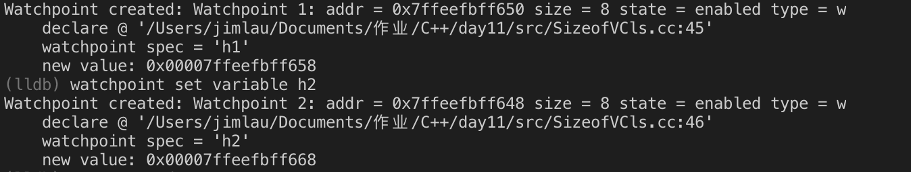
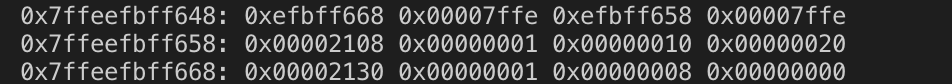
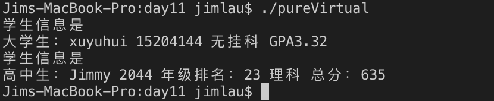

# C++ day11

## 简答题

### 1. 什么是多态？虚函数的实现原理是什么

多态是在指针或引用访问对象时，反映出与对象本身特点相关的动态性，比如在基类指针中访问函数得到派生类成员函数的特点，在多基派生中的虚基类消除二义性都是多态的范畴。虚函数通过虚函数指针vfptr指向虚函数表得到其代码段，在运行时访问虚函数表决定要使用的函数，而不是在编译时决定。

### 2. 构造函数能设置为虚函数吗？为什么

不可以，因为构造函数并非唯一的，且参数表互不相同，设置为虚函数要求函数名相同、参数、返回值相同，否则表现为隐藏(oversee)，不表现覆盖(override)。从逻辑上讲，构造函数是在实体构造的过程中调用的函数，不存在基类指针访问这样的情况，只能是由实体调用，不表现动态特性

### 3. 在什么情况下析构函数要设置成虚函数？为什么

在用基类指针指向堆区初始化派生类对象时，释放基类指针操作(`delete pbase`)只执行基类析构函数，而不会对派生类对象进行销毁工作，造成内存泄露等隐患。从析构函数的功能上可以发现，析构过程理应如何执行是与对象绑定的，事实上有多少资源就理应释放多少，与调用析构函数的指针是什么无关。综上，只要类具有动态特性，就把析构函数设置成虚函数，从而能够与对象绑定，防止动态释放资源出现内存泄露。

### 4. 什么是纯虚函数？什么是抽象类？抽象类的作用是什么

纯虚函数是形如 `func()=0`的函数定义，没有给出实现，只要有至少一个这样的函数就属于抽象类，抽象类不可产生实例化对象，只能向下派生出子类，可以泛化子类的通用方法，增加了代码的重用

### 5. 什么是重载？什么是隐藏？什么是覆盖？他们之间的区别是

1. 重载(`overload`)是在成员函数、普通函数中，函数名相同时，根据参数类型、参数个数、`const`不同而决定执行的函数  
2. 隐藏(`oversee`)是在派生类成员中，使用了与基类同名的成员，直接默认调用派生类成员，需要作用域限定符才可以显式调用派生类  
3. 覆盖(`override`)是在基类中声明了虚函数(包括纯虚函数)，在派生类中实现了相同名字，相同返回值、形参表的成员函数，会发生覆盖，具有动态特性  

> 他们之间的主要区别在于覆盖在运行时由指针、链表(虚函数表)决定调用函数段的地址，属于动态联编；重载和隐藏在编译时由编译器分析决定目标函数段地址，属于静态联编。

### 6. 关于虚函数 vs 虚拟继承内存布局的问题都有哪些规则

在成员函数中定义了虚函数就增加8字节(64 位操作系统)内存空间的虚函数指针 vfptr，在派生类定义中声明了虚继承就增加一个虚基指针(事实上只需指向内存空间尾部虚基类开始的位置) vbptr，并且将继承来的虚基类成员(包括vfptr)放在对象成员内存空间的最后。

## 代码实现 当天所写代码都实现一遍，加强巩固语法规则

> (关于虚函数与虚继承混合使用的情况，通过多做测试的方式来掌握，是比较好的方式，纯粹记忆效果不明显)  

### 1. 虚继承类对象大小

```cpp
// src/SizeofVCls.cc
#include <iostream>

using std::cout;
using std::cin;
using std::endl;

class vbase
{
public:
    virtual void display()
    {
        cout<<"I am virtual base\n";
    }
    long int _vvb = 8;
};

class base
{
public:
    base() = default;
    virtual void display()
    {
        cout<<"I am base\n";
    }
private:
    int _bv = 16;
};

class child:virtual public vbase, public base
{
public:
    virtual void display()
    {
        cout<<"I am child\n";
    }
    virtual void show(){}
private:
    int _cv = 32;
};

int main()
{
    int j = 0, k = 0;
    child me;
    base& h1 = me;
    vbase& h2 = me;
    int i = 6;
    me.display();
    h1.display();
    h2.display();
    printf("Sizeof me = %ld\n", sizeof(me));
}
```

`lldb`调试结果：

<div><center>


对象空间

指针内容
</div>

### 2. 纯虚函数

```cpp
#include <iostream>
#include <string>

using std::cout;
using std::cin;
using std::endl;
using std::string;

class student
{
public:
    virtual void info()const =0;
    student(const string&nm, long int sno)
    : _nm(nm), _sno(sno)
    {}

    friend std::ostream& operator<<(std::ostream& os, const student &stu)
    {
        os<<"学生信息是"<<endl;
        stu.info();
        return os;
    }

protected:
    string _nm;
    long int _sno;
};

class CollegeStudent: public student
{
public:
    CollegeStudent(string name, long int sno, float gpa = 0, bool failed = 0)
    :student(name, sno), _failbit(failed), _gpa(gpa){}
    void info()const
    {
        cout<<"大学生：";
        cout<<student::_nm<<' '<<student::_sno<<' ';
        if(_failbit)
            cout<<"有挂科 ";
        else
            cout<<"无挂科 ";
        cout<<"GPA"<<_gpa<<endl;
    }
private:
    bool _failbit;
    float _gpa;
};

class SeniorStudent: public student
{
public:
    SeniorStudent(string name, long int sno, int rank = -1, int latestGrade = -1, bool scienceOrArts = 0)
    : student(name, sno), _rank(rank), _latestGrade(latestGrade), _scienceOrArts(scienceOrArts){}
    void info()const
    {
        cout<<"高中生：";
        cout<<student::_nm<<' '<<student::_sno<<' '<<"年级排名："<<_rank<<' ';
        if(_scienceOrArts)
            cout<<"理科 ";
        else
            cout<<"文科 ";
        cout<<"总分："<<_latestGrade<<endl;
    }
private:
    int _rank;
    int _latestGrade;
    bool _scienceOrArts;
};


int main()
{
    CollegeStudent xuyuhui("xuyuhui", 15204144, 3.32);
    SeniorStudent me("Jimmy", 2044, 23, 635, 1);
    cout<<xuyuhui;
    cout<<me;
    return 0;
}
```

运行结果：

<div><center>


</div>