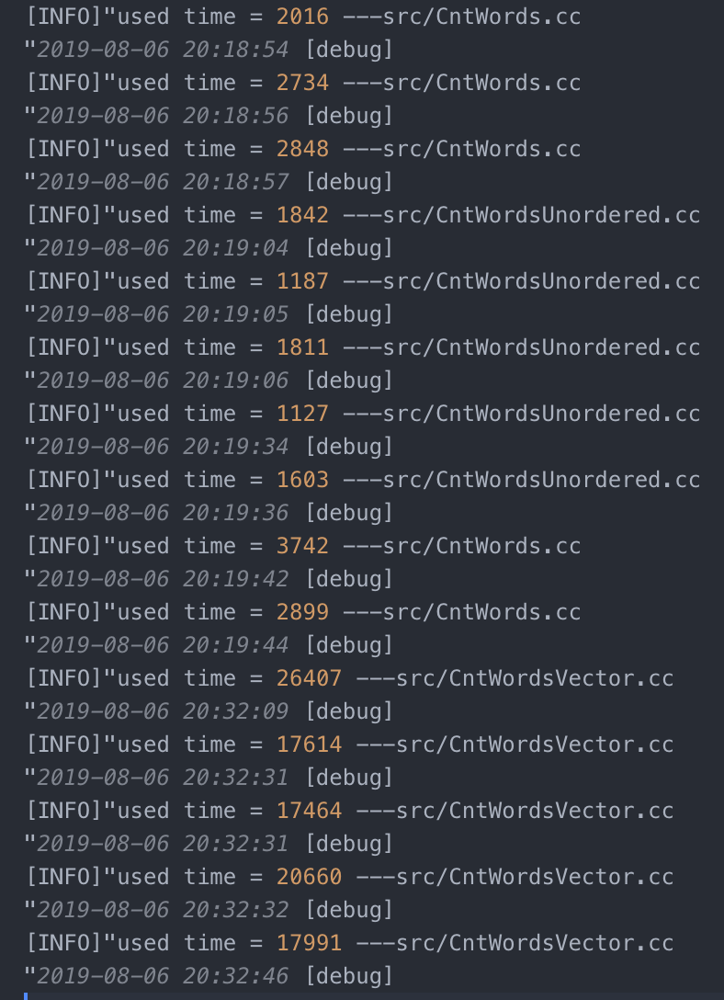
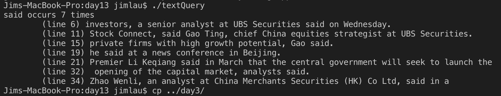

# C++ day13

## 1. 词频统计的作业再用map/unordered_map容器去实现一次，体验一下使用vector/map/unordered_map时程序执行的速度

只使用Vector的用时是map的10倍

```cpp
// "src/CntWordsVector.cc"
#include <sys/time.h>
#include <time.h>
#include "../include/log4cpp_head.hh"
#include <iostream>
#include <fstream>
#include <vector>
#include <map>
#include <unordered_map>

using namespace std;

string getWord(ifstream &file)
{
    string str;
    char ch;
    do
    {
        file.get(ch);
    }while(isalpha(ch) == 0 && !file.eof());
    while(isalpha(ch) && !file.eof())
    {
        str.push_back(ch);
        file.get(ch);
    }
    return str;
}

int main(int argc, const char * argv[])
{
    vector<pair<string, int>> dictionary;
    ifstream file(argv[1], ios_base::in);
    string word;
    timeval begin, end;
    gettimeofday(&begin, NULL);
    int cnt = 0;
    while(!file.eof())
    {
        word = getWord(file);
        for (int i = 0; i < cnt; ++i)
        {
            if(dictionary[i].first == word)
                ++dictionary[i].second;
        }
        dictionary.push_back(pair(word, 1));
        ++cnt;
    }
    vector<pair<string, int>>::iterator it = dictionary.begin();
    if(it->first.empty())
        ++it;
    gettimeofday(&end, NULL);
    Log::genObj();
    Log::LogInfo("used time = %ld ---%s\n", (end.tv_sec - begin.tv_sec) * 1000000 + end.tv_usec - begin.tv_usec, __FILE__);
    for(; it != dictionary.end(); ++it)
    {
        printf("%-20s %d\n", it->first.c_str(), it->second);
    }
    file.close();
    return 0;
}
```

```cpp
// "src/CntWords"
#include <sys/time.h>
#include <time.h>
#include "../include/log4cpp_head.hh"
#include <iostream>
#include <fstream>
#include <vector>
#include <map>
#include <unordered_map>

using namespace std;

string getWord(ifstream &file)
{
    string str;
    char ch;
    do
    {
        file.get(ch);
    }while(isalpha(ch) == 0 && !file.eof());
    while(isalpha(ch) && !file.eof())
    {
        str.push_back(ch);
        file.get(ch);
    }
    return str;
}

int main(int argc, const char * argv[])
{
    map<string, int> dictionary;
    ifstream file(argv[1], ios_base::in);
    string word;
    timeval begin, end;
    gettimeofday(&begin, NULL);
    while(!file.eof())
    {
        word = getWord(file);
        ++dictionary[word];
    }
    map<string, int>::iterator it = dictionary.begin();
    if(it->first.empty())
        ++it;
    gettimeofday(&end, NULL);
    Log::genObj();
    Log::LogInfo("used time = %ld ---%s\n", (end.tv_sec - begin.tv_sec) * 1000000 + end.tv_usec - begin.tv_usec, __FILE__);
    for(; it != dictionary.end(); ++it)
    {
        printf("%-20s %d\n", it->first.c_str(), it->second);
    }
    file.close();
    return 0;
}
```

改成`unordered_map`之后，速度再提升一倍。  
运行结果如下：  


## 2. 文本查询作业

```cpp
    该程序将读取用户指定的任意文本文件【当前目录下的china_daily.txt】，然后允许用户从该文件中查找单词。查询的结果是该单词出现的次数，并列出每次出现所在的行。如果某单词在同一行中多次出现，程序将只显示该行一次。行号按升序显示。

    要求：
    a. 它必须允许用户指明要处理的文件名字。

    b. 程序将存储该文件的内容，以便输出每个单词所在的原始行。
         vector<string> lines;//O(1)  完美hash
      或 map<int, string> lines;//O(logN)
      或 unorderedmap<int,string> lines;//O(1)

    c. 它必须将每一行分解为各个单词，并记录每个单词所在的所有行。
        在输出行号时，应保证以升序输出，并且不重复。

        map<string, set<int> > word2Line;
        map<string, int> dict;

    d. 对特定单词的查询将返回出现该单词的所有行的行号。

    e. 输出某单词所在的行文本时，程序必须能根据给定的行号从输入
        文件中获取相应的行。

    示例：
        使用提供的文件内容，然后查找单词 "element"。输出的前几行为：
        ---------------------------------------------
        element occurs 125 times.
            (line 62) element with a given key.
            (line 64) second element with the same key.
            (line 153) element |==| operator.
            (line 250) the element type.
            (line 398) corresponding element.
        ---------------------------------------------

        程序接口[可选]:
            class TextQuery
            {
            public:
                void readFile(const string filename);
                void query(const string & word);
            private:
                        //......
            };

            //程序测试用例
            int main(int argc, char *argv[])
            {
                string  queryWord("hello");

                TextQuery tq;
                tq.readFile("test.dat");
                tq.query(queryWord);
                return 0;
            }
```

```cpp
// "src/textQuery.cc"
class TextQuery
{
public:
    void readFile(const string &filename);
    void query(const string & word);
    TextQuery()
    : _lines(), _word2Line(), _dict()
    {}
    ~TextQuery()
    {}
private:
    vector<string> _lines;
    map<string, set<int>> _word2Line;
    map<string, int> _dict;

};

string getWord(std::istream &file);

void TextQuery::readFile(const string &filename)
{
    std::ifstream file(filename, std::ios_base::in);
    string line, word;
    char ch;
    size_t i = 0;
    while(file.get(ch) && !file.eof())
    {
        if(ch == '\n')
        {
            ++i;
            std::istringstream strStream(line);
            do
            {
                word = ::getWord(strStream);
                ++_dict[word];
                _word2Line[word].insert(i);
            }while(word.empty() == false);
            _lines.push_back(line);
            line.clear();
        } else {
            line.push_back(ch);
        }
    }
    file.close();

}

void TextQuery::query(const string & word)
{
    printf("%s occurs %d times\n", word.c_str(), _dict[word]);
    for(auto it = _word2Line[word].begin(); it != _word2Line[word].end(); ++it)
    {
        printf("\t(line %d) ", *it);
        cout<<_lines[*it - 1]<<endl;
    }
}
```

运行结果：  


## 3. Leetcode 146 LRU [题目在当前目录下]

```cpp
#include <iostream>
#include <unordered_map>
#include <list>

using std::pair;
using std::unordered_map;
using std::list;

class LRUCache {
public:
    LRUCache(int capacity)
    :_size(capacity)
    {}
    int get(int key) {
        auto it = _dict.find(key);
        if(it == _dict.end())
            return -1;
        int value = it->second->second;
        _list.erase(it->second);
        _list.push_front(std::make_pair(key, value));
        _dict[key] = _list.begin();
        return value;
    }

    void put(int key, int value) {
        auto it = _dict.find(key);
        if(it != _dict.end())
        {
            _list.erase(it->second);
        }
        _list.push_front(std::make_pair(key, value));
        _dict[key] = _list.begin();
        if(_list.size() > _size)
        {
            int key = _list.back().first;
            _dict.erase(key);
            _list.pop_back();
        }
    }
private:
    unordered_map<int, list<pair<int, int> >::iterator >_dict;
    list<pair<int, int> > _list;
    int _size;
};

int main()
{
    LRUCache cache(2);
    cache.put(1, 1);
    cache.put(2, 2);
    std::cout<<cache.get(1)<<std::endl;       // 返回  1
    cache.put(3, 3);    // 该操作会使得密钥 2 作废
    std::cout<<cache.get(2)<<std::endl;           // 返回 -1 (未找到)
    cache.put(4, 4);    // 该操作会使得密钥 1 作废
    std::cout<<cache.get(1)<<std::endl;          // 返回 -1 (未找到)
    std::cout<<cache.get(3)<<std::endl;         // 返回  3
    std::cout<<cache.get(4)<<std::endl;           // 返回  4
    return 0;
}
/**
 * Your LRUCache object will be instantiated and called as such:
 * LRUCache* obj = new LRUCache(capacity);
 * int param_1 = obj->get(key);
 * obj->put(key,value);
 */
```

## 4. 实现一个堆排序算法

   可选择使用模板或非模板的实现：

   使用模板的框架如下：

```cpp
template <typename T, typename Compare = std::less<T> >
class HeapSort
{
public:
    void operator()(T* beg, T* end)
    {
        _it = beg;
        _size = end - beg;
        heapAdjust();
        sort();
    }
    void heapAdjust();
    void sort();
private:
    T* _it;
    int _size;
    priority_queue<T, vector<T>, Compare> _heap;
};
```

```cpp
#include <queue>
#include <iostream>
#include <array>

using namespace std;

template <typename T, typename Compare>
void HeapSort<T, Compare>::heapAdjust()
{
    for (int i = 0; i < _size; ++i)
    {
        _heap.push(*(_it + i));
    }
}

template <typename T, typename Compare>
void HeapSort<T, Compare>::sort()
{
    for (int i = 0; i < _size; ++i)
    {
        *(_it + i) = _heap.top();
        _heap.pop();
    }
}

int main()
{
    std::array<int, 5> a = {4, 3 ,4, 5, 2};
    HeapSort<int> x;
    x(a.begin(), a.end());
    for (auto i = a.begin(); i != a.end(); i++)
    {
        printf("%d\n", *i);
    }

    return 0;
}
```
