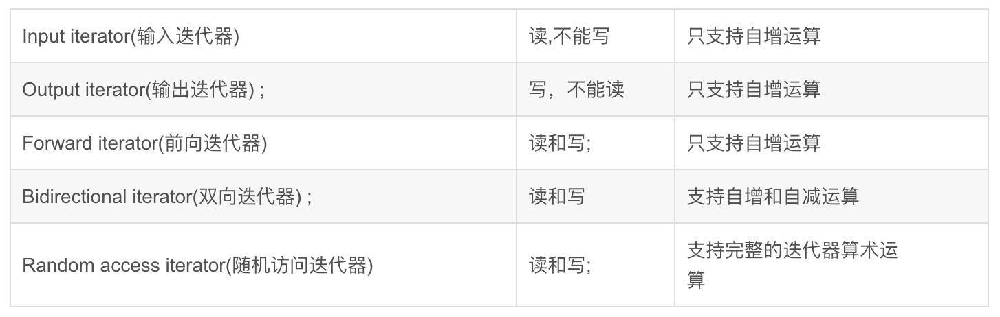

# C++ day14

## 问答题

### 1. 迭代器的种类有哪些？他们各自的功能是什么？为什么要定义这么多种类



输入：为程序需要数据源提供接口，数据源可以是容器，数据流等，输入迭代器只能从一个序列读入数据，此类迭代器可以被修改，引用并进行比较。  

输出： 用于输出程序中得到的结果，输出迭代器只能向一个序列输出数据，此类迭代器可以被修改和引用。  

前向：可以随意访问序列中的元素，可以用来读，也可写。并能保存迭代器的值，以便重新从原先位置开始遍历。  

双向： 能够读写，也可被增值和减值，同时进行前向和逆向操作，所有stl都提供双向迭代器；  

随机访问： 可以通过跳跃的方式访问容器中的任意数据，访问数据灵活。具有双向迭代器所有功能，冰球能使用算法和所有迭代器的比较功能。  

### 2. 通过阅读迭代器源码的方式来理解迭代器，如

> RandomAccess_iterator  
> bidirectional_iterator  
> forward_iterator  
> ostream_iterator  
> istream_iterator  

### 3. 什么是适配器模式？STL中有哪些适配器

适配器模式(Adapter Pattern)：将一个接口转换成客户希望的另一个接口，使接口不兼容的那些类可以一起工作，其别名为包装器(Wrapper)。适配器模式既可以作为类结构型模式，也可以作为对象结构型模式。  
在适配器模式中，我们通过增加一个新的适配器类来解决接口不兼容的问题，使得原本没有任何关系的类可以协同工作。  
根据适配器类与适配者类的关系不同，适配器模式可分为对象适配器和类适配器两种，在对象适配器模式中，适配器与适配者之间是关联关系；在类适配器模式中，适配器与适配者之间是继承（或实现）关系。  

STL的适配器：  

1. `iterator`迭代器适配器，包括`reverse_iterator`、`iostream iterator`、`insert iterator`、
2. `container`容器适配器: `queue`、`stack`、`priority_queue`，前两者用到的容器都是`deque`，后者的实现可以是`vector`或者`deque`
3. `functor`仿函数适配器:  
（1）联结（bind）：通过bind，仿函数与参数进行绑定，可实现算法的参数按需要传递  
（2）否定（negate）：这里就是取反的操作，例如not1(bind(less(),12, _2))，就可判断不小于12的元素。  
（3）组合（compose）：当算法的判断条件需要进行一些复杂的数学运算时，即可采用这种适配操作。  
（4）一般函数适配器：一般函数可以当做仿函数供STL算法使用，但无配接能力，需要将其包装成仿函数，其原理就是在仿函数的运算符()内执行其所包装的函数即可。  
（5）成员函数适配器：这里将成员函数包装成仿函数，从而可使用成员函数搭配各种泛型算法。当容器内存储的是对象的实体时，需使用mem_fun_ref进行适配；当容器内存储的是对象的指针时，需使用mem_fun进行适配。  

## 代码题

### 1. Leetcode 20 Valid Parentheses -->stack

Given a string containing just the characters '(', ')', '{', '}', '[' and ']', determine if the input string is valid.  
An input string is valid if:

1. Open brackets must be closed by the same type of brackets.
2. Open brackets must be closed in the correct order.

Note that an empty string is also considered valid.  
Example 1:  
Input: "()"Output: true  
Example 2:  
Input: "()[]{}"Output: true  
Example 3:  
Input: "(]"Output: false  
Example 4:  
Input: "([)]"Output: false  
Example 5:  
Input: "{[]}"Output: true  

```cpp
#include <iostream>
#include <sstream>
#include <stack>
#include <vector>

using std::stack;
using std::cin;
using std::cout;
using std::endl;
using std::string;

int main()
{
    stack<char, std::vector<char> > stack;
    char ch, check;
    while(!cin.eof())
    {
        cin.get(ch);
        if(ch == ']' || ch == '}' || ch == ')')
        {
            check = stack.top();
            if(stack.empty()||(ch == ']' && check != '[')|| (ch == '}' && check != '{') || (ch == ')' && check != '('))
            {
                cout<<"false"<<endl;
                return 0;
            }
            stack.pop();
        }
        if(ch == '{' || ch == '(' || ch == '[')
        {
            stack.push(ch);
        }
    }
    cout<<"true"<<endl;
    return 0;
}
```

### 2. Leetcode 127 Word Ladder

Given two words (beginWord and endWord), and a dictionary's word list, find the length of shortest transformation sequence from beginWord to endWord, such that:

1. Only one letter can be changed at a time.  
2. Each transformed word must exist in the word list. Note that beginWord is not a transformed word.  
Note:  
• Return 0 if there is no such transformation sequence.  
• All words have the same length.  
• All words contain only lowercase alphabetic characters.  
• You may assume no duplicates in the word list.  
• You may assume beginWord and endWord are non-empty and are not the same.  
Example 1:  
Input:  
beginWord = "hit",  
endWord = "cog",  
wordList = ["hot","dot","dog","lot","log","cog"]  
Output: 5  
Explanation: As one shortest transformation is "hit" -> "hot" -> "dot" -> "dog" -> "cog",  
return its length 5.  
Example 2:  
Input:  
beginWord = "hit"  
endWord = "cog"  
wordList = ["hot","dot","dog","lot","log"]  
Output: 0  
Explanation: The endWord "cog" is not in wordList, therefore no possible transformation.

广度优先算法步骤：

1. 将所有的单词构建一个`unordered_map`，其中的`key`键值为，替换第一个至最后一个字母为`*`的`string`作为**跳板**，以挂有所有满足到**跳板**一跳条件单词(`string`类型)的`list`为值  
2. 判断目标单词是否在单词集中，如果不在就返回`0`  
3. 建立一个存储目标查询单词和当前深度的队列(`<string, int>`)，将待查询初始单词和初始深度(为`1`)入队  
4. 当队列不为空时，出队，将每一位字母替换为`*`之后按该跳板到**步骤1**中的`unordered_map`中查找符合条件的所有下一跳单词，并且将其和深度入队，之后循环执行直至目标查询单词和最后的目标单词相等返回。

```cpp
class Solution {
public:
    Solution()
    : _wordList(), _targetList()
    {}
    int ladderLength(const string& begWord, const string& endWord, const vector<string> &set)
    {
        if(std::find(set.begin(), set.end(), endWord) == set.end())
            return 0;
        _wordList.clear();
        for(auto &mem: set)
        {
            string word;
            auto len = mem.size();
            for(int i = 0; i < len; ++i)
            {
                word = mem;
                word[i] = '*';
                _wordList[word].push_back(mem);
            }
        }
#ifndef NDEBUG
        cout<<"_wordHashList:"<<endl;
        for(auto &mem: _wordList)
        {
            cout<<mem.first<<' ';
            for(auto &word: mem.second)
            {
                cout<<word<<' ';
            }
            cout<<endl;
        }
        cout<<endl;
#endif

        /* 先把word化为通用的替换word */
        int depth = 0;
        _targetList.emplace(begWord, 1);
        string target, copy;
        while(!_targetList.empty())
        {
            depth = _targetList.front().second + 1;
            // cout<<"depth = "<<depth<<endl;
            target = _targetList.front().first;
            _targetList.pop();
            for(int i = 0; i < target.size(); ++i)
            {
                copy = target;
                copy[i] = '*';
                if(_wordList.find(copy) == _wordList.end())
                    continue;
                for(auto iter = _wordList[copy].begin(); iter != _wordList[copy].end();)
                {
                    auto &mem = *iter;
                    // cout<<mem<<' ';
                    if(mem == endWord)
                        return depth;
                    _targetList.push(make_pair(mem, depth));
                    iter = _wordList[copy].erase(iter);
                }
                // cout<<endl;
            }
            // cout<<endl;
        }
        return 0;
    }

private:
    unordered_map<string, list<string> > _wordList;
    queue<std::pair<string, int> > _targetList;

};
```

### 3. 完成C++ primer(第5版)中的15.9节的文本查询程序扩展,即使不自己实现, 最好也要照着书敲一遍代码,在机器上让程序跑起来, 也会让你对面向对象设计有新的理解.[慢慢做]
