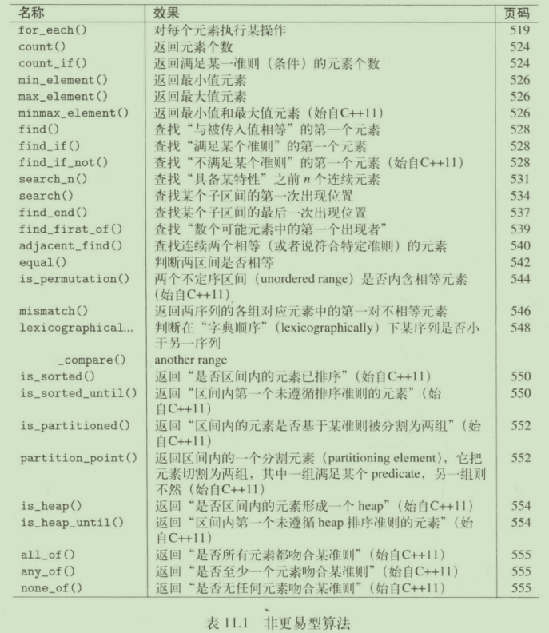
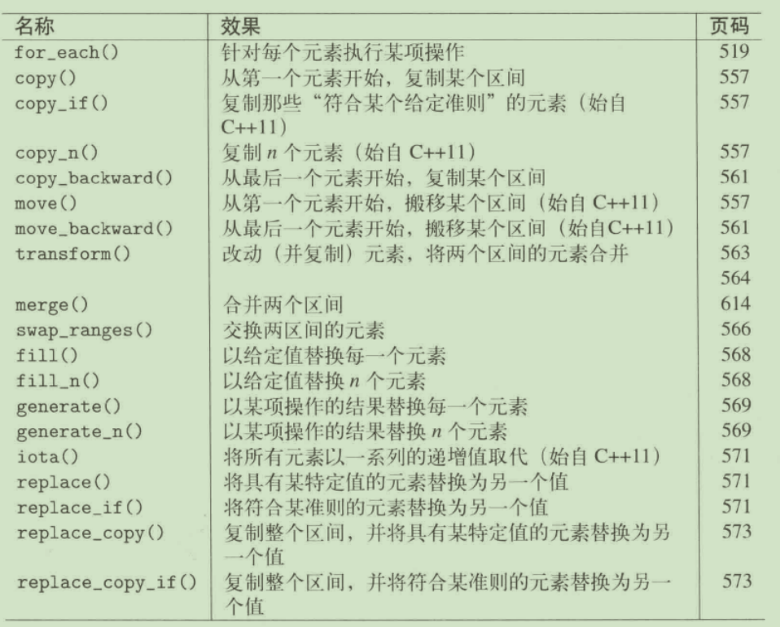
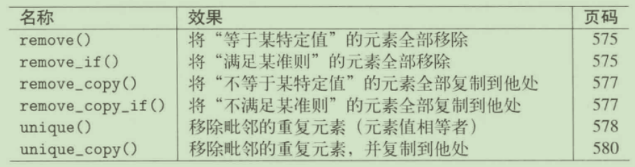
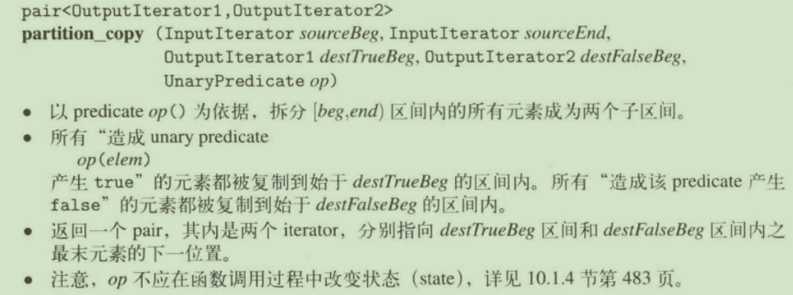
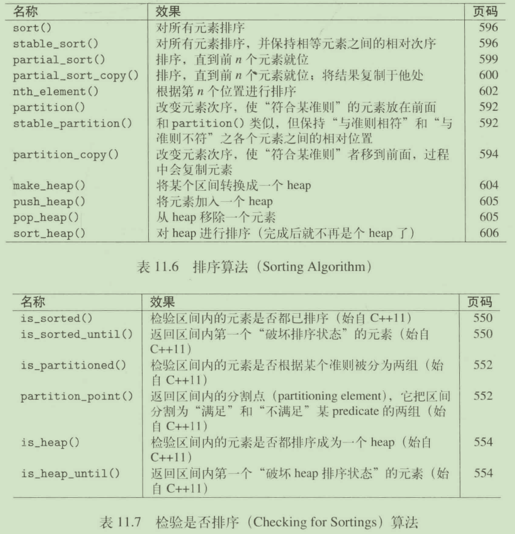
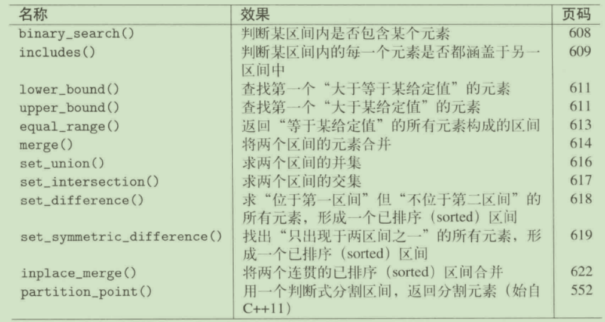
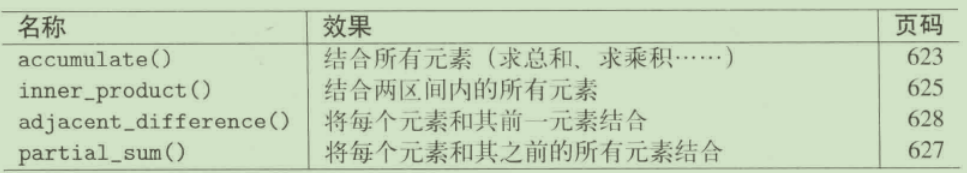
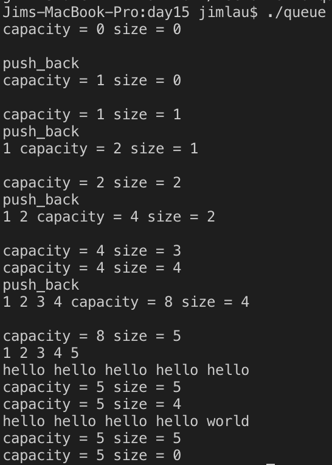
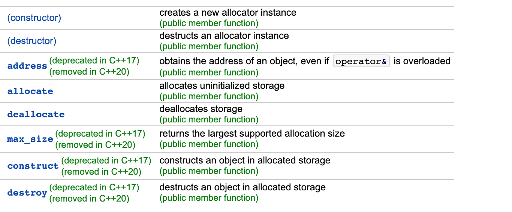
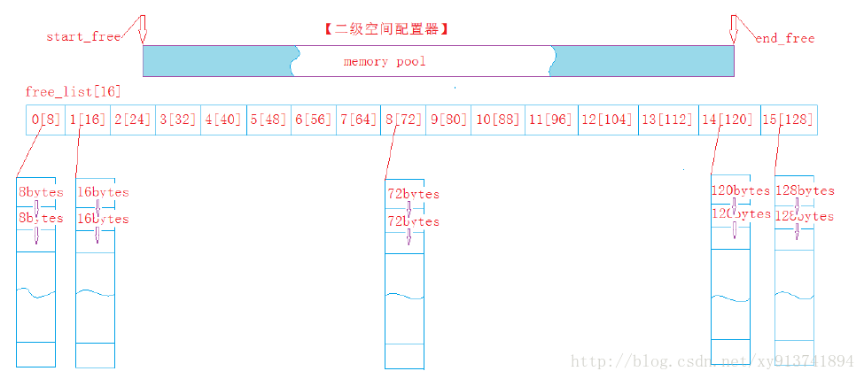

# C++ day15_刘立京

## 1. 算法库中有哪些类型的操作？什么是函数对象

+ 非修改型算法（nomodifying algorithm）  

+ 修改型算法（modifying algorithm）  

+ 移除型算法（removing algorithm）  

+ 变序型算法（mutating algorithm）  


+ 排序算法（sorting algorithm）  

+ 已排序区间算法（sorted-range algorithm）  

+ 数值算法（numeric algorithm）包含在`<numeric>`头文件中  


> [图片来源](https://www.cnblogs.com/larry-xia/p/9497340.html)

## 2. 容器、迭代器、算法之间的关系是怎样的？他们是如何结合在一起的

`容器`用来存放可扩展的若干数据，`迭代器`是**泛型指针**，在`容器`和`算法`之间建立关联，使得`算法`可以操作`容器`中的每一个元素。

## 3. 什么是迭代器失效问题？该问题是如何产生的？怎样避免产生迭代器失效问题

迭代器所指元素在进行一些**移动**、**插入**、**删除**、操作之后，迭代器理应不再使用，但却仍然被误用的问题。  
由于迭代器并非就是`原生指针(native pointer)`，在进行了元素的调整之后可能就无法使用了，而需要重新赋值，所以不理解`stl`的C风格编程习惯容易导致该问题  
在循环体内刷新(`refresh`)迭代器，在循环体外不要储存`off-the-end`迭代器，保证从`end()`获取到最新的`off-the-end`。

## 4. 什么是回调函数，注册回调函数，执行回调函数？(掌握std::bind用法,非常重要)

回调函数是由**函数指针**调用的、其他函数的调用方用于对特定事件的响应的函数，不是由函数的实现方直接调用。
注册回调函数可以通过`std::bind`，也可以定义函数指针直接赋值为函数地址。

用法:

```cpp
auto f = std::bind(::func, std::cin, _3, _1); // 可以预先传入参数，可以调换参数顺序，可以不响应部分参数
f('a', 'b', 'c'); // 调用
```

> std::bind的实现原理阅读材料  
> [[1]](http://www.cnblogs.com/xusd-null/p/3698969.html)  
> [[2]](https://www.tuicool.com/articles/iMZ7ba)  
> [function + bind的救赎](https://blog.csdn.net/myan/article/details/5928531)

## 5. 了解std::allocator的用法之后,实现自定义的Vector类

Vector模型  

```txt
     ______________________________  
    |_|_|_|_|_|____________________|  
     ↑         ↑                   ↑  
   _start   _finish          _end_of_storage
```

接口形式：  

```cpp
template <class Tp, class Alloc = allocator<Tp> >
class vector
{
public:

    typedef Tp value_type;
    typedef value_type* pointer;
    typedef value_type* iterator;
    typedef value_type& reference;
    typedef ptrdiff_t difference_type;
    typedef const value_type* const_iterator;
    typedef const value_type& const_reference;

    const_iterator cbegin() const {   return _first;}
    const_iterator cend() const {   return _last;}
    iterator begin() {   return _first;}
    iterator end() {   return _last;}
    difference_type capacity() {    return _end - _first;}
    difference_type size() {    return _last - _first;}
    reference operator[](size_t index)
    {
        return *(_first + index);
    }
    const_reference operator[](size_t index) const
    {
        return *(_first + index);
    }

    vector()
    : _first(nullptr), _last(nullptr), _end(nullptr)
    {}

    vector(size_t size, value_type val)
    {
        _last =_first = _alloc.allocate(size);
        for(int i = 0; i < size; ++i)
        {
            _alloc.construct(_last++, val);
        }
        _end = _last;
    }

    vector(size_t size)
    {
        _last =_first = _alloc.allocate(size);
        for(int i = 0; i < size; ++i)
        {
            _alloc.construct(_last++);
        }
        _end = _last;
    }

    iterator push_back(const value_type& val)
    {
        auto sz = capacity();
        if(_end == _last){
            reallocate(sz > 0 ? (sz << 1) : 1);
            printf("%s\n", __FUNCTION__);
            for(auto iter = cbegin(); iter != cend(); ++iter)
            {
                std::cout<<*iter<<' ';
            }
            cout<<"capacity = "<<capacity()<<" size = "<<size()<<endl;
            std::cout<<std::endl;
        }
        _alloc.construct(_last++, val);
        return _last;
    }

    void pop_back()
    {
        if(_last == _first)
            return;
        _alloc.destroy(--_last);
    }


    ~vector()
    {
        clear();
        _alloc.deallocate(_first, capacity());
    }

    void clear()
    {
        if(_first == _last)
            return;
        while(--_last >= _first )
            _alloc.destroy(_last);
        _last = _first;
    }

protected:

    void reallocate(size_t newSize)
    {
        iterator tmpPtr = _alloc.allocate(newSize);
        if(_first != _last)
            std::uninitialized_copy(_first, _last, tmpPtr);

        auto sz = capacity();
        clear();
        _alloc.deallocate(_first, sz);

        _end = &tmpPtr[newSize];
        _last = &tmpPtr[sz];
        _first = tmpPtr;
    }

    iterator _first;
    iterator _last;
    iterator _end;
    static Alloc _alloc;

};

template<class Tp, class Alloc>
Alloc vector<Tp, Alloc>::_alloc;
```

测试程序：  

```cpp
int main()
{
    vector<int> a;
    vector<string> b(5, "hello");
    for(auto iter = a.cbegin(); iter != a.cend(); ++iter)
    {
        std::cout<<*iter<<' ';
    }
    cout<<"capacity = "<<a.capacity()<<" size = "<<a.size()<<endl;
    std::cout<<std::endl;

    for(int i = 1; i <= 5; ++i)
    {
        a.push_back(i);
        cout<<"capacity = "<<a.capacity()<<" size = "<<a.size()<<endl;
    }
    for(auto iter = a.cbegin(); iter != a.cend(); ++iter)
    {
        std::cout<<*iter<<' ';
    }
    std::cout<<std::endl;

    for(auto iter = b.cbegin(); iter != b.cend(); ++iter)
    {
        std::cout<<*iter<<' ';
    }
    std::cout<<std::endl;
    cout<<"capacity = "<<b.capacity()<<" size = "<<b.size()<<endl;
    b.pop_back();
    cout<<"capacity = "<<b.capacity()<<" size = "<<b.size()<<endl;
    b.push_back("world");
    for(auto iter = b.cbegin(); iter != b.cend(); ++iter)
    {
        std::cout<<*iter<<' ';
    }
    std::cout<<std::endl;
    cout<<"capacity = "<<b.capacity()<<" size = "<<b.size()<<endl;
    b.clear();
    cout<<"capacity = "<<b.capacity()<<" size = "<<b.size()<<endl;

    return 0;
}
```

测试结果如下：  


分配器的重要接口：  

  

1. `destroy`：直接显式调用每个元素的`析构函数`  
2. `construct` ====》 调用**placement new**函数进行构造  

应该使用`placement new`原型：  


```cpp
void *operator new( size_t, void *p ) throw()     { return p; }
{
    new(size_t size) Tp(args...);
}
```

其他的`new`操作符原型：  


3. `template <class Tp> std::allocator<Tp> allocate(size_t)`仅进行大小为`Tp * size`的内存分配并返回内存位置，并不对每格空间进行对象初始化  
4. `deallocate(iterator, size_t)`回收指针所指的大小为`size`的内存，并且不执行目标内存对应对象的析构函数  

## 6. 结合STL源码阅读《STL源码剖析》第二章内容理解std::allocator的实现

1. 一级配置器的使用，直接封装`new`和`delete`在返回指针为`null`时，调用`OOM_Handler`函数处理该情况，默认在sgi_stl中不可直接配置一级配置器  
2. 二级配置器的使用。


在二级配置器当中，形成一个链表，编号0~15的链表分别存放8~128块大小的空闲链表队列。

1. 当分配的空间大于128字节时直接用一级配置器分配，在小于128字节可以找到空闲块时，以8的倍数返回空闲块空间  
2. 当分配的空间无空闲块时，在内存池(图中`memory_pool`)中查找可用空间。默认为链表返回20个空闲块，不足则返回不少于1的空闲块，1个都不足则将内存池剩余的空间按大小挂载到链表上，并且`malloc`出若干块并且将20块分配给空闲链表。  
3. 如果`malloc`申请失败，则查找空闲链表更大的空闲块调出来挂到内存池。  
4. 最后不足则采用一级配置器的`OOM_HANDLER`方法
