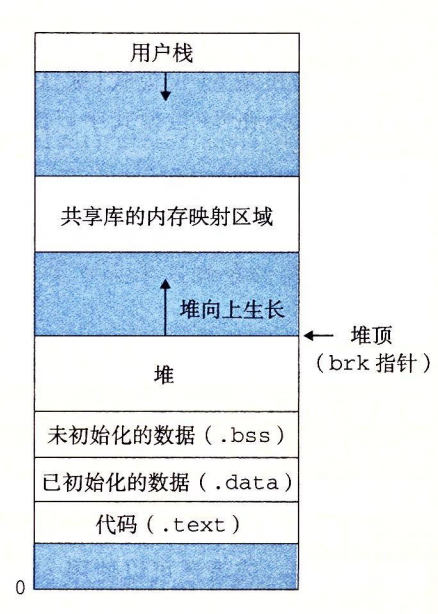
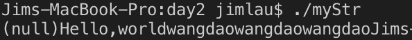

# C++: day2 

## 1. C++内存布局分为几个区域，各自具备什么特点

1. 内存从下到上共有`4 GB`虚拟内存空间，从`0x0`到大约`0x08048`为系统环境空间，从`0x80000`大约`3 GB`到`0xfffff`为内核代码空间。
2. 自`3 GB`往低地址增长的为栈空间，栈空间下面往上增长的为内存映射区，包括`mmap`、写时复制、动态库等映射技术的空间。
3. 自内存映射区下的位置往上增长的为堆空间，堆空间是进程运行时的动态空间。
4. 从系统环境空间往上的为代码区(`.text`)，代码区而上为只读字符区(`.data`)，只读字符区而上为`.bss`区，包括初始化和未初始化的静态变量、全局变量。
5. 全局变量而上为堆空间底部。



## 2. 当定义类时，编译器会为类自动生成哪些函数？这些函数各自都有什么特点

构造函数(`constructor`)和析构函数(`destructor`)，构造函数和析构函数都没有返回类型且与类重名，而析构函数在前面添加`~`。

1. 构造函数可以重载，析构函数不可重载。
2. 构造函数在初始化、赋值、传参、类型转换时会调用。析构函数在函数消亡的时候自动地调用。
3. 构造函数和析构函数都可以灵活地定义为私有、公有成员。

## 3. 什么是浅拷贝, 什么是深拷贝

1. 拷贝是定义的由拷贝构造函数(`_class_A_(const _class_A_& x)`)
2. 浅拷贝是类中的指针对象的值直接赋值为传入实体的地址，在调用析构函数时会`delete`两次，造成程序崩溃
3. 深拷贝不是简单的指针定位，而是开辟相同大小的空间，使得指针对象指向这一空间，并且复制传入的实体的值

## 4. 实现一个自定义的String类，保证main函数对正确执行

```cpp
class String
{
public:
    String();
    String(const char *pstr);
    String(const String & rhs);
    String & operator=(const String & rhs);
    ~String();

    void print();

private:
    char * _pstr;
};

int main(void)
{
    String str1;
    str1.print();

    String str2 = "Hello,world";
    String str3("wangdao");

    str2.print();
    str3.print();

    String str4 = str3;
    str4.print();

    str4 = str2;
    str4.print();

    return 0;
}
```

填充代码如下：

```cpp
String::String()
{
    _pstr = NULL;
}

String::String(const char *pstr)
{
    _pstr = new char[strlen(pstr) + 1];
    strcpy(_pstr, pstr);
}

String::String(const String & rhs)
{
    this->_pstr = new char[strlen(rhs._pstr) + 1];
    strcpy(this->_pstr, rhs._pstr);
}

String::~String()
{
    if(_pstr)
        delete []_pstr;
    _pstr = NULL;
}

String & String::operator=(const String & rhs)
{
    if(&rhs == this) return *this;
    if(_pstr)
        delete []this->_pstr;
    this->_pstr = new char[strlen(rhs._pstr) + 1];

    return *this;
}

void String::print()
{
    printf("%s", this->_pstr);
}
```

编译后，运行结果如下：

