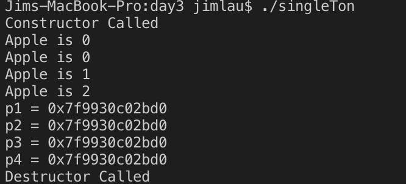
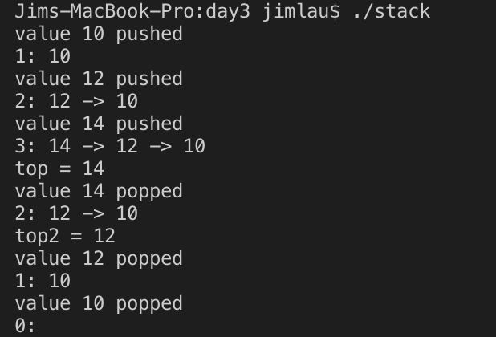
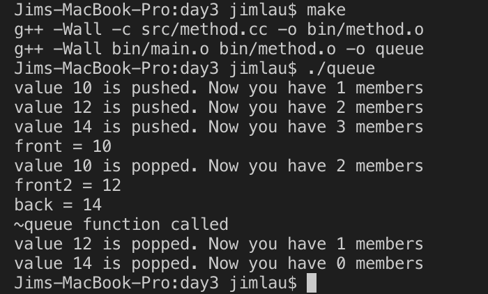
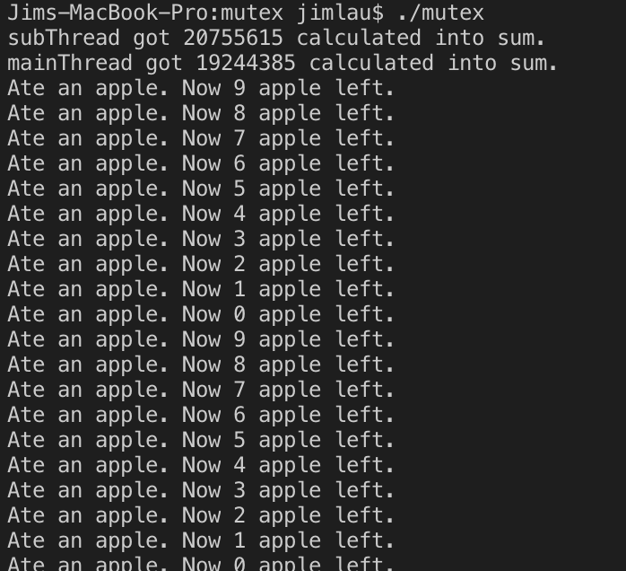

# C++: day3 

## 1. 熟练掌握单例模式的用法，做到随手写出来

```cpp
#include <iostream>
/* singleton */
class soloA
{
    int _apple;
    static soloA* _savePtr;
    soloA(){std::cout<<"Constructor Called\n";}
    soloA(const soloA&x){}
    ~soloA(){std::cout<<"Destructor Called\n";}
    public:
        static soloA* getObj()
        {
            if (_savePtr)
            {
                return _savePtr;
            } else {
                _savePtr = new soloA();
                return _savePtr;
            }
        }
        static void destroy()
        {
            if(_savePtr)
            {
                delete _savePtr;
                _savePtr = nullptr;
            }
        }
        void print()
        {
            std::cout<<"Apple is "<<_apple++<<std::endl;
        }
        void print() const
        {
            std::cout<<"Apple is "<<_apple<<std::endl;
        }
};
soloA* soloA::_savePtr = nullptr;

int main()
{
    soloA* p1= soloA::getObj(), *p2 = soloA::getObj(), *p3 = p2;
    const soloA* p4;
    p4 = p2;
    p4->print();
    p3->print();
    p2->print();
    p1->print();
    std::cout<<"p1 = "<< p1<<std::endl
            <<"p2 = "<< p2<<std::endl
            <<"p3 = "<< p3<<std::endl
            <<"p4 = "<< p4<<std::endl;
    soloA::destroy();
    return 0;
}
```

结果如下：


## 2. 编写一个类，实现简单的栈。栈中有以下操作

> 元素入栈     `void push(int);`
> 元素出栈     `void pop();`
> 读出栈顶元素 `int top();`
> 判断栈空     `bool emty();`
> 判断栈满    `bool full();`

如果栈溢出，程序终止。栈的数据成员由存放10个整型数据的数组构成。先后做如下操作：

> 创建栈
> 将10入栈
> 将12入栈
> 将14入栈
> 读出并输出栈顶元素
> 出栈
> 读出并输出栈顶元素

```cpp
#include <iostream>
struct linkNode
{
    int value;
    linkNode* next;
    linkNode(int x = 0):value(x), next(nullptr){}
};

class stack
{
    linkNode* _top;
    public:
    stack(){_top = new linkNode();}
    stack(const stack &x):_top(x._top){}
    void push(int a)
    {
        auto tmp = new linkNode(a);
        tmp->next = _top->next;
        _top->next = tmp;
        printf("value %d pushed\n", tmp->value);
        ++_top->value;
        print();
    }
    int pop()
    {
        if(0 >= _top->value || nullptr == _top->next)
        {
            printf("pop failure\n");
            return -1;
        }
        --_top->value;
        auto tmp = _top->next;
        int x = -1;
        if(_top->next)
        {
            x = tmp->value;
            _top->next = _top->next->next;
            delete tmp;
            printf("value %d popped\n", x);
        }
        print();
        return x;
    }
    int top()
    {
        if(0 < _top->value && _top->next)
        {
            return _top->next->value;
        } else {
            printf("top failure\n");
            return -1;
        }
    }
    void print()
    {
        linkNode *ptr = _top;
        printf("%d: ", ptr->value);
        ptr = ptr->next;
        while(ptr)
        {
            printf("%d ", ptr->value);
            if(ptr -> next)
                printf("-> ");
            ptr = ptr->next;
        }
        printf("\n");
    }
    ~stack()
    {
        while(_top->next)
            pop();
        delete _top;
    }
};

int main()
{
    stack ss1;
    int a;
    a = 10;ss1.push(a);
    a = 12;ss1.push(a);
    a = 14;ss1.push(a);
    int top = ss1.top();
    std::cout<<"top = "<<top<<std::endl;
    ss1.pop();
    top = ss1.top();
    std::cout<<"top2 = "<<top<<std::endl;
    return 0;
}
```

运行结果：


## 3. 编写一个类，实现简单的队列。队列中有以下操作

> 元素入队             void push(int);
> 元素出队             void pop();
> 读取队头元素         int front();
> 读取队尾元素         int back();
> 判断队列是否为空     bool emty();
> 判断队列是否已满     bool full();

```cpp
// "./include/queueHead.h"
#ifndef _QUEUE_HEAD_H
#define _QUEUE_HEAD_H
#include <iostream>
struct linkNode
{
    int value;
    linkNode* next;
    linkNode(int x = 0):value(x), next(nullptr){}
};

class queue
{
    linkNode* _head, *_tail;

public:
    queue(){_tail = _head = new linkNode;}
    queue(const queue &x):_head(x._head), _tail(x._tail){}

    /* 元素入队  */
    void push(int);
    /* 元素出队 */
    void pop();
    /* 读取队头元素 */
    int front();
    /* 读取队尾元素 */
    int back();
    /* 判断队列是否为空 */
    bool empty();
    /* 判断队列是否已满 */
    bool full();
    ~queue();
};

#endif
```

```cpp
// "./src/method.cc"
#include "../include/queueHead.h"

void queue::push(int x)
{
    linkNode* tmp = new linkNode(x);
    _tail->next = tmp;
    _tail = _tail->next;
    printf("value %d is pushed. Now you have %d members\n", _tail->value, ++_head->value);
}

void queue::pop()
{
    linkNode* tmp = _head -> next;
    if(empty()) return;

    printf("value %d is popped. Now you have %d members\n", tmp->value, --_head->value);
    _head -> next = _head -> next -> next;
    delete tmp;
}

int queue::front()
{
    int ret = -1;
    if(empty())
    {
        printf("get value failed\n");
        return ret;
    }
    ret = _head -> next -> value;
    return ret;
}

int queue::back()
{
    int ret = -1;
    if(empty())
    {
        printf("get value failed\n");
        return ret;
    }
    ret = _tail -> value;
    return ret;
}

bool queue::empty()
{
    return _head->value == 0 || _head == _tail;
}

bool queue::full()
{
    return false;
}

queue::~queue()
{
    printf("%s function called\n", __FUNCTION__);
    while(1)
    {
        if(empty())
        {
            delete _head;
            break;
        }
        pop();
    }
}
```

```cpp
// "./src/main.cc"
#include <iostream>
#include "../include/queueHead.h"

int main()
{
    queue sq2;
    int a;
    a = 10;sq2.push(a);
    a = 12;sq2.push(a);
    a = 14;sq2.push(a);
    int front = sq2.front();
    std::cout<<"front = "<<front<<std::endl;
    sq2.pop();
    front = sq2.front();
    std::cout<<"front2 = "<<front<<std::endl;
    int tail = sq2.back();
    std::cout<<"back = "<<tail<<std::endl;

    return 0;
}
```

运行结果：


## 4. 在封装Linux下互斥锁和条件变量,并自行编写测试程序

互斥锁MutexLock和条件变量Condition类的框架如下：

```cpp
   class MutexLock
   {
   public:
      //...
            void lock();
            void unlock();
    private:
        //...
   };

   class Condition
   {
    public:
        //...
            void wait();
            void notify();
            void notifyall();
    private:
        //...

   };
```

```cpp
// "./src/method.cc"
#include "../include/mutex.h"

MutexLock::MutexLock()
{
    pthread_mutex_init(&_lock, NULL);
}

MutexLock::~MutexLock()
{
    pthread_mutex_destroy(&_lock);
}

void MutexLock::lock()
{
    pthread_mutex_lock(&_lock);
}

void MutexLock::unlock()
{
    pthread_mutex_unlock(&_lock);
}

pthread_mutex_t* MutexLock::getLock()
{
    return &_lock;
}

Condition::Condition(MutexLock &x):_condLock(x)
{
    pthread_cond_init(&_cond, NULL);
}

Condition::~Condition()
{
    pthread_cond_destroy(&_cond);
}

void Condition::notify()
{
    pthread_cond_signal(&_cond);
}

void Condition::notifyall()
{
    pthread_cond_broadcast(&_cond);
}

void Condition::wait()
{
    pthread_cond_wait(&_cond, _condLock.getLock());
}
```

```cpp
// "./src/mutex.cc"
#include "../include/mutex.h"
#define N 40000000
#include <unistd.h>
MutexLock mutex;
Condition cond(mutex);

void *threadFunc(void *p)
{
    int &sum = *(int *)p;
    int x = 0;
    while(N > sum)
    {
        mutex.lock();
        ++sum;
        mutex.unlock();
        ++x;
    }
    printf("subThread got %d calculated into sum.\n", x);
    pthread_exit(NULL);
}

void clean(void *p)
{
    MutexLock &mutex = *(MutexLock *)p;
    mutex.unlock();
}

void *threadEat(void *p)
{
    int &apple = *(int *)p;
    while(1)
    {
        sleep(1);
        mutex.lock();
        pthread_cleanup_push(clean, &mutex);
        if(0 == apple)
            cond.wait();
        --apple;
        printf("Ate an apple. Now %d apple left.\n", apple);
        pthread_cleanup_pop(0);
        mutex.unlock();
    }
}

int main()
{
    int sum = 0;
    pthread_t thid, thid2;
    pthread_create(&thid, NULL, threadFunc, (void *)&sum);
    int x = 0;
    while(N > sum)
    {
        mutex.lock();
        ++sum;
        mutex.unlock();
        ++x;
    }
    printf("mainThread got %d calculated into sum.\n", x);
    pthread_join(thid, nullptr);

    int apple = 10;
    pthread_create(&thid, NULL, threadEat, (void *)&apple);
    pthread_create(&thid2, NULL, threadEat, (void *)&apple);

    int cnt = 0;
    while(1)
    {
        sleep(3);
        if(0 >= apple)
        {
            apple += 10;
            cond.notify();
        }
        ++cnt;
        if(cnt >=2)
        {
            cond.notifyall();
        }
    }

    return 0;
}
```

运行结果如下：


## 5. 预习后面的内容
