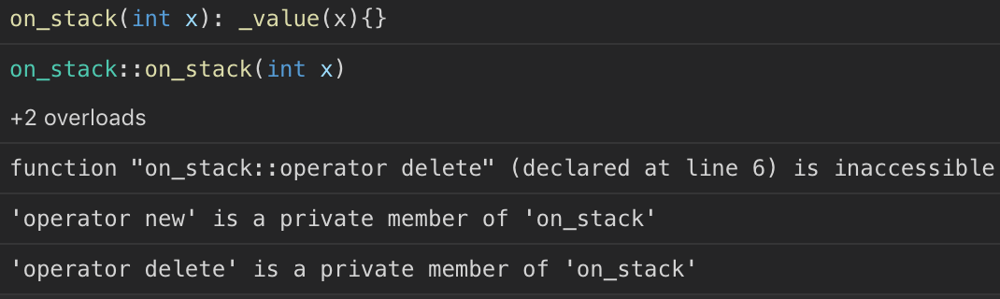
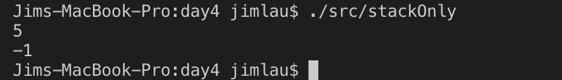
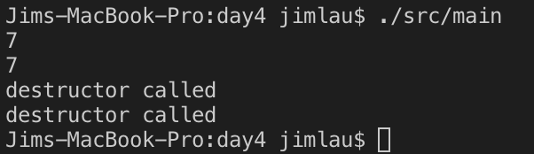
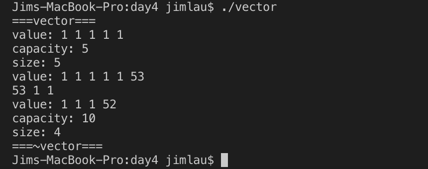
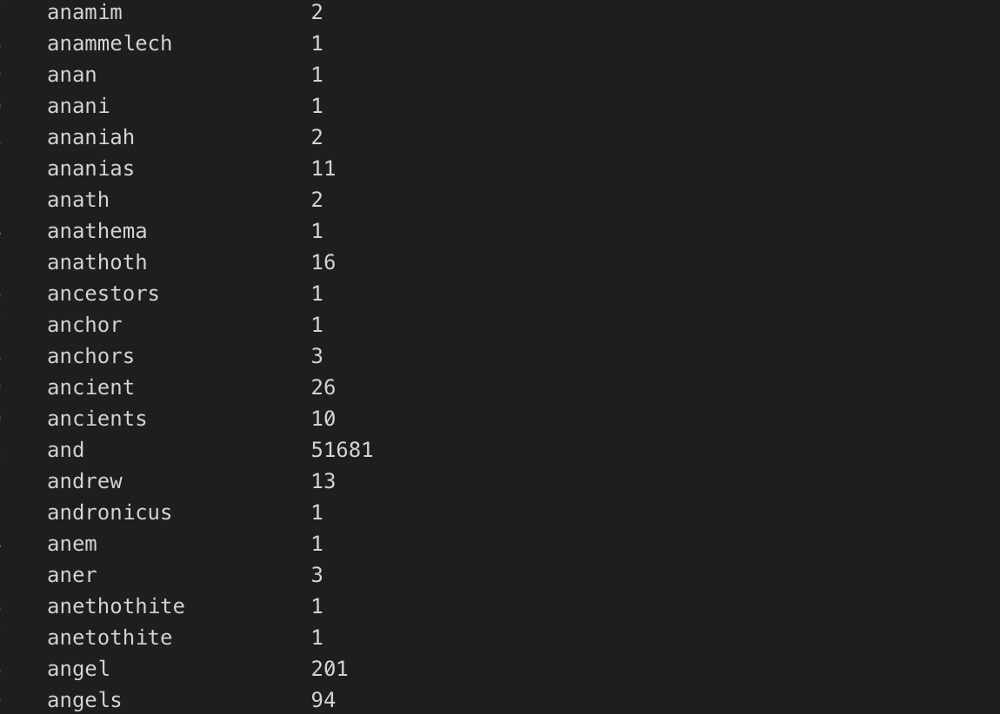
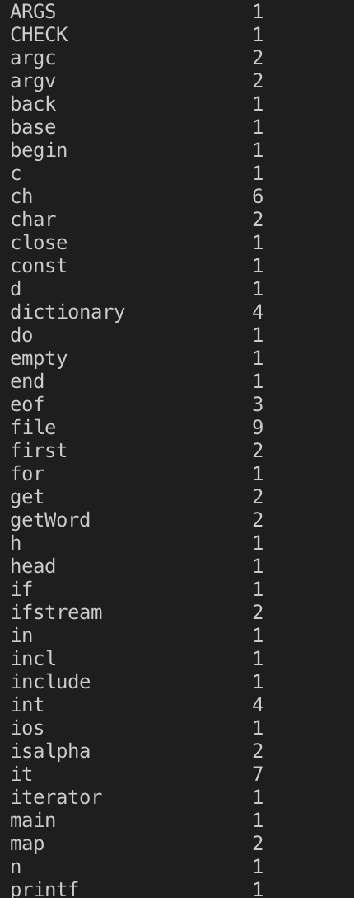

# C++: day4 

## 1. 实现只能生成栈对象的代码

```cpp
#include <iostream>

class on_stack
{
    void * operator new(size_t);
    void operator delete(void *);
    int _value;
public:
    on_stack(): _value(-1){}
    on_stack(int x): _value(x){}
    ~on_stack(){}
    friend std::ostream & operator<<(std::ostream &out, const on_stack& x)
    {
        out<<x._value;
        return out;
    }
};

int main()
{
    class on_stack a, b(5);
    std::cout<<b<<std::endl;
    b = a;
    std::cout<<b<<std::endl;
    return 0;
}
```

运行结果：




## 2. 实现只能生成堆对象的代码

```cpp
class on_heap
{
    static on_heap* _restore;
    int _value;

public:
    void* operator new(size_t x)
    {
        if(_restore)
            return _restore;
        _restore = (on_heap *)malloc(x);
        return _restore;
    }
    // friend on_heap* genObj(int x = -1)
    // {
    //     if(on_heap::_restore)
    //         return on_heap::_restore;
    //     return new on_heap(x);
    // }
    // void destroy()
    // {
    //     std::cout<<"destructor called"<<std::endl;
    //     if(_restore)
    //     {
    //         _restore = nullptr;
    //         delete this;
    //     }
    // }
    void operator delete(void *p)
    {
        std::cout<<"destructor called"<<std::endl;
        if(_restore == nullptr) return;
        _restore = nullptr;
        free(p);
    }
    ~on_heap(){}
    on_heap(){}
    on_heap(int x):_value(x){}
    friend std::ostream & operator<<(std::ostream &out, const on_heap& x)
    {
        out<<x._value;
        return out;
    }
};

on_heap* on_heap::_restore = nullptr;

int main()
{
    on_heap *c = new on_heap(7);
    std::cout<<*c<<std::endl;
    on_heap *d = new on_heap;
    std::cout<<*d<<std::endl;
    delete d;
    delete c;
    return 0;
}
```

运行结果：


## 3. vector底层是如何实现的

三个指针：`Type* _beg, Type* _fin, Type* _end_of_storage`

```cpp
// "include/vector.h"
#include <iostream>

template <class T> class vector
{
    T* _beg;
    T* _fin;
    T* _end_of_storage;
public:
    vector(){_beg = _fin = _end_of_storage = nullptr;}
    vector(const size_t n, const T &value)
    : _beg(new T[n * 2])
    {
        printf("===%s===\n", __FUNCTION__);
        _end_of_storage = _beg + n * 2;
        _fin = _beg + n;
        for(T *iterator = _beg;iterator != _fin; ++iterator)
            *iterator = value;
    }
    void push_back(const T& value)
    {
        if(_fin == _end_of_storage)
        {
            size_t size = _end_of_storage - _beg;
            T *newPtr = new T[size * 2];
            memcpy(newPtr, _beg, size * sizeof(T));
            delete []_beg;
            _beg = newPtr;
            _fin = newPtr + size;
            _end_of_storage = newPtr + size * 2;
        }
        *_fin++ = value;
    }
    T pop()
    {
        if(_beg == _fin)
            return 0;
        return *(--_fin);
    }
    size_t capacity()
    {
        return _end_of_storage - _beg;
    }
    size_t size()
    {
        return _fin - _beg;
    }
    ~vector()
    {
        printf("===%s===\n", __FUNCTION__);
        delete []_beg;
        _beg = _fin = _end_of_storage = nullptr;
    }
    friend std::ostream& operator <<(std::ostream& out, const vector<T> &v)
    {
        for(T* iterator = v._beg;iterator != v._fin; ++iterator)
        {
            out<<*iterator<<" ";
        }
        return out;
    }
};
```

```cpp
// "src/vector.cc"
#include "../include/vector.h"

int main()
{
    vector<int> v(5, 1);
    std::cout<<"value: "<<v<<std::endl;
    std::cout<<"capacity: "<<v.capacity()<<std::endl;
    std::cout<<"size: "<<v.size()<<std::endl;
    v.push_back(53);
    std::cout<<"value: "<<v<<std::endl;
    std::cout<<v.pop()<<" "<<v.pop()<<" "<<v.pop()<<std::endl;
    v.push_back(52);
    std::cout<<"value: "<<v<<std::endl;
    std::cout<<"capacity: "<<v.capacity()<<std::endl;
    std::cout<<"size: "<<v.size()<<std::endl;
    return 0;
}
```

运行结果如下：


## 4. 统计一篇英文(The_Holy_Bible.txt)文章中出现的单词和词频，输入：某篇文章的绝对路径。输出：词典（词典中的内容为每一行都是一个“单词 词频”）

词典的存储格式如下

```cpp
 -----------------
|   a 66          |
|   abandon 77    |
|   public 88     |
|    ......       |
|_________________|
```

```cpp
// "incl/head.h"
#ifndef _HEAD_H
#define _HEAD_H

#define _GNU_SOURCE
#include <cstdio>
#include <cstring>
#include <fstream>
#include <iostream>
#include <string>
#include <map>
using std::map;
using std::string;
using std::cin;
using std::cout;
using std::endl;
using std::istream;
using std::istringstream;
using std::ifstream;

#define ARGS_CHECK(argc, num) {if(argc != num) {printf("Error args!\n"); return -1;}}
#endif
```

```cpp
// "src/main.cc"
#include "../incl/head.h"

string getWord(ifstream &file)
{
    string str;
    char ch;
    do
    {
        file.get(ch);
    }while(isalpha(ch) == 0 && !file.eof());
    while(isalpha(ch) && !file.eof())
    {
        str.push_back(ch);
        file.get(ch);
    }
    return str;
}

int main(int argc, const char * argv[])
{
    ARGS_CHECK(argc, 2);
    map<string, int> dictionary;
    ifstream file(argv[1], std::ios_base::in);
    string word;
    while(!file.eof())
    {
        word = getWord(file);
        ++dictionary[word];
    }
    map<string, int>::iterator it = dictionary.begin();
    /* 判断结尾是否读进去了空字符串，如果以非单词结尾会读入空字符串 */
    if(it->first.empty())
        ++it;
    for(; it != dictionary.end(); ++it)
    {
        printf("%-20s %d\n", it->first.c_str(), it->second);
    }
    file.close();
    return 0;
}
```

运行结果:


