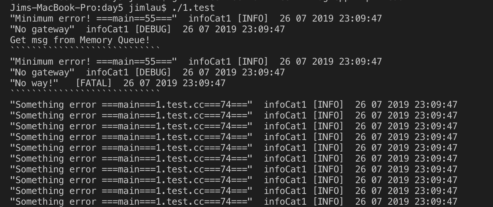
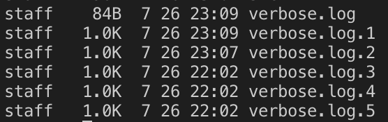
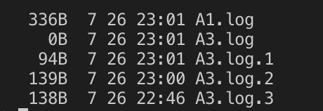

# C++: day5 

## 1. 熟悉log4cpp的用法，动手敲代码

[log4cpp的学习链接](http://blog.csdn.net/liuhong135541/article/category/1496383)

头文件：
`include/log4cpp_head.hh`

```cpp
#ifndef _LOG4CPP_HEAD_HH
#define _LOG4CPP_HEAD_HH

#include <log4cpp/Category.hh>
#include <log4cpp/PropertyConfigurator.hh>
#include <log4cpp/OstreamAppender.hh>
#include <log4cpp/BasicLayout.hh>
#include <log4cpp/Priority.hh>
#include <log4cpp/PatternLayout.hh>
#include <log4cpp/StringQueueAppender.hh>
#include <log4cpp/RollingFileAppender.hh>

using namespace log4cpp;

#endif
```

使用`configure`之前配置`log4cpp`的方法：
(`RollingFileAppender`, `StringQueueAppender`, `OstreamAppender`)
(`PatternLayout`)
(`Category::getRoot`, `rt.getInstance`)

```cpp
#include "./include/log4cpp_head.hh"
#include <iostream>
#include <queue>

/*
typedef enum {
    EMERG  = 0,
    FATAL  = 0,
    ALERT  = 100,
    CRIT   = 200,
    ERROR  = 300,
    WARN   = 400,
    NOTICE = 500,
    INFO   = 600,
    DEBUG  = 700,
    NOTSET = 800
} PriorityLevel;
*/


using std::cout;
using std::endl;
using std::cin;
using std::queue;
using std::string;

/* 封装设计输出格式 */
#define setLayout(append) {    PatternLayout* pLayout = new PatternLayout(); \
    pLayout->setConversionPattern("\"%m\"  %c [%p] %x %d{%d %m %Y %H:%M:%S}%n");  \
    append->setLayout(pLayout);}

int main()
{
    /* Appender绑定输出途径，常用的有IO流，string队列，log文件 */
    StringQueueAppender* strApp = new StringQueueAppender("strApp");
    OstreamAppender* osAppend = new OstreamAppender("osAppend", &cout);
    RollingFileAppender* rfApp = new RollingFileAppender("rfApp", "verbose.log", 1024, 5);

    /* 设置输出格式 */
    setLayout(strApp);
    setLayout(osAppend);
    setLayout(rfApp);

    /* Category设置Category记录的从属，流绑定以及信息分类 */
    Category& rt = Category::getRoot();
    Category& infoCat1 = rt.getInstance("infoCat1");

    infoCat1.addAppender(osAppend);
    infoCat1.addAppender(rfApp);
    infoCat1.setPriority(Priority::DEBUG);

    rt.addAppender(strApp);
    rt.setPriority(Priority::EMERG);

    infoCat1.info("Minimum error! ===%s==%d===", __FUNCTION__, __LINE__);
    infoCat1.debug("No gateway");
    rt.warn("SYSTEM FATAL ERROR!");
    rt.emerg("No way!");
    // infoCat1.removeAppender(osAppend);

    /* 获取信息队列，防止在多线程中多次中断开启I/O系统调用 */
    cout<<"Get msg from Memory Queue!"<<endl;
    cout<<"````````````````````````````"<<endl;
    queue<string>& Str = strApp->getQueue();
    while(!Str.empty())
    {
        cout<<Str.front();
        Str.pop();
    }
    cout<<"````````````````````````````"<<endl;
    /* 输出滚动日志 */
    for (int i = 0; i < 10; i++)
    {
        infoCat1.info("Something error ===%s===%s===%d===", __FUNCTION__, __FILE__, __LINE__);
    }

    Category::shutdown();
    return 0;
}
```

运行结果：



使用`configure`之后配置`log4cpp`的方法：

`config/log4cpp.config`文件:

```conf
# 定义了3个category sub1, sub2, sub3
# 其中sub2和sub3设置了additivity属性为false;sub1的additivity属性默认为true
rootCategory=DEBUG, rootAppender

category.sub1=,A1

category.sub2=INFO, A2
additivity.sub2=false

category.sub3=ERROR, A3
additivity.sub3=false


# 定义rootAppender类型和layout属性，这里使用了BasicLayout
appender.rootAppender=org.apache.log4cpp.ConsoleAppender
appender.rootAppender.layout=org.apache.log4cpp.BasicLayout

#定义A1的属性，这里使用了SimpleLayout
appender.A1=org.apache.log4cpp.FileAppender
appender.A1.fileName=./log/A1.log
appender.A1.layout=org.apache.log4cpp.SimpleLayout

#定义A2的属性，这里使用了PatternLayout
appender.A2=org.apache.log4cpp.ConsoleAppender
appender.A2.layout=org.apache.log4cpp.PatternLayout
appender.A2.layout.ConversionPattern=The message '%m' at time %d%n

#定义A3的属性
appender.A3=org.apache.log4cpp.RollingFileAppender
appender.A3.fileName=./log/A3.log
appender.A3.maxFileSize=50
appender.A3.maxBackupIndex=3
appender.A3.backupPattern=%Y-%m-%d
appender.A3.layout=org.apache.log4cpp.PatternLayout
appender.A3.layout.ConversionPattern=%d{%Y-%m-%d %H:%M:%S} [%p]: [%c] %m%n
```

测试代码如下：

```cpp
#include "../include/log4cpp_head.hh"
#include <iostream>
#include <queue>

using std::string;
using std::cout;
using std::queue;
using std::endl;

int main()
{
    try
    {
        PropertyConfigurator::configure("./config/test.conf");
    }
    catch(ConfigureFailure& f)
    {
        std::cerr << f.what() << '\n';
        return -1;
    }

    log4cpp::Category& root = log4cpp::Category::getRoot();
    log4cpp::Category& sub1 = log4cpp::Category::getInstance(std::string("sub1"));
    log4cpp::Category& sub2 = log4cpp::Category::getInstance(std::string("sub2"));
    log4cpp::Category& sub3 = log4cpp::Category::getInstance(std::string("sub3"));
    // log4cpp::Category& sub4 = log4cpp::Category::getInstance(std::string("sub4"));

     //    正常使用这些category对象进行日志处理。
    root.fatal("root's log");

    //    sub1 has appender A1 and rootappender. since the additivity property is set true by default
    sub1.info("sub1's log");

    //    sub2 has appender A2 appender. since the additivity property is set to false
    sub2.alert("sub2's log");

    //    sub3 only has A3 appender. since the additivity property is set to false
    sub3.debug("sub3's log");
    sub3.alert("sub3's log");

    // //    sub4 can not be found in the config file, so the root category's appender and layout are used
    // sub4.warn("sub4's log");
    return 0;
}
```

运行结果：



## 2. 封装log4cpp,使用起来比较方便，如下所示

```cpp
// 使用范例
// 输出的日志信息能同时输出到终端和文件
int main(void)
{
    cout << "hello,world"<<endl;

    LogInfo("Message");//或者
    LogError("Message");
    LogWarn("Message");
    LogDebug("Message");
}
```

```cpp
// 使用单例模式
// 加分项：输出的日志信息中最好能有文件的名字，函数的名字及其所在的行号
class Mylogger
{
public:
    void warn(const char * msg);
    void error(const char * msg);
    void debug(const char * msg);
    void info(const char * msg);

private:
    Mylog();
    ~Mylog();
private:
    //......
};

Mylogger * log = Mylogger::getInstance();
log->warn("hello");
```

```cpp
#include "../include/log4cpp_head.hh"

using std::cout;
using std::endl;

class Log
{
public:

    static Log* genObj();
    static void destroy();
    // void warn(const char *);
    // void fatal(const char *);
    // void debug(const char *);
    log4cpp::Category& _root;
    log4cpp::Category& fatal;
    log4cpp::Category& warn;
    log4cpp::Category& debug;
    friend inline void prt(void(*f)(const char* Format, ...), const char * str);

private:
    Log();
    ~Log();

    static Log* _restore;
};

Log* Log::_restore = nullptr;

Log::Log():
    _root(log4cpp::Category::getRoot()),
    fatal(log4cpp::Category::getInstance(std::string("fatal"))),
    warn(log4cpp::Category::getInstance(std::string("warn"))),
    debug(log4cpp::Category::getInstance(std::string("debug")))
    {}

Log::~Log(){}

Log* Log::genObj()
{
    if(_restore)
        return _restore;
    try
    {
        PropertyConfigurator::configure("./config/log4cpp.conf");
    }
    catch(ConfigureFailure& f)
    {
        std::cerr << f.what() << '\n';
        return (Log *)-1;
    }
    _restore = new Log;
    return _restore;
}

void Log::destroy()
{
    if(_restore)
        delete _restore;
    _restore = nullptr;
}

inline void prt(void(*f)(const char* Format, ...), const char * str)
{
    f("%s --%s--%s--%d--", str, __FILE__, __FUNCTION__, __LINE__);
}

int main()
{
    Log* pLog = Log::genObj();
    std::string x = "Hello";
    x += " No Way";
    pLog->debug.info("%s --%s--%s--%d--", x.c_str(), __FILE__, __FUNCTION__, __LINE__);
    pLog->debug.debug("%s --%s--%s--%d--", x.c_str(), __FILE__, __FUNCTION__, __LINE__);
    pLog->debug.emerg("%s --%s--%s--%d--", x.c_str(), __FILE__, __FUNCTION__, __LINE__);
    pLog->fatal.error("%s --%s--%s--%d--", x.c_str(), __FILE__, __FUNCTION__, __LINE__);
    pLog->fatal.fatal("%s --%s--%s--%d--", x.c_str(), __FILE__, __FUNCTION__, __LINE__);

    Log::destroy();
    return 0;
}
```

```conf
# 定义了3个category fatal, warn, debug
# 其中warn和debug设置了additivity属性为false;fatal的additivity属性默认为true

rootCategory=DEBUG, rootAppender, A3

category.fatal=WARN,A1

category.warn=NOTICE, A2

# category.debug=DEBUG,

# 定义rootAppender类型和layout属性，这里在bash打印与log中相同的内容
appender.rootAppender=org.apache.log4cpp.ConsoleAppender
appender.rootAppender.layout=org.apache.log4cpp.PatternLayout
appender.rootAppender.layout.ConversionPattern=[%p]"%m"%d{%Y-%m-%d %H:%M:%S} [%c]%n

#定义fatal记录、warn记录、debug记录的属性
appender.A1=org.apache.log4cpp.RollingFileAppender
appender.A1.fileName=./log/error.log
appender.A1.maxFileSize=102400
appender.A1.maxBackupIndex=3
appender.A1.backupPattern=%Y-%m-%d
appender.A1.layout=org.apache.log4cpp.PatternLayout
appender.A1.layout.ConversionPattern=[%p]"%m"%d{%Y-%m-%d %H:%M:%S} [%c]%n

appender.A2=org.apache.log4cpp.RollingFileAppender
appender.A2.fileName=./log/warn.log
appender.A2.maxFileSize=102400
appender.A2.maxBackupIndex=3
appender.A2.backupPattern=%Y-%m-%d
appender.A2.layout=org.apache.log4cpp.PatternLayout
appender.A2.layout.ConversionPattern=[%p]"%m"%d{%Y-%m-%d %H:%M:%S} [%c]%n

appender.A3=org.apache.log4cpp.RollingFileAppender
appender.A3.fileName=./log/debug.log
appender.A3.maxFileSize=102400
appender.A3.maxBackupIndex=3
appender.A3.backupPattern=%Y-%m-%d
appender.A3.layout=org.apache.log4cpp.PatternLayout
appender.A3.layout.ConversionPattern=[%p]"%m"%d{%Y-%m-%d %H:%M:%S} [%c]%n
```
