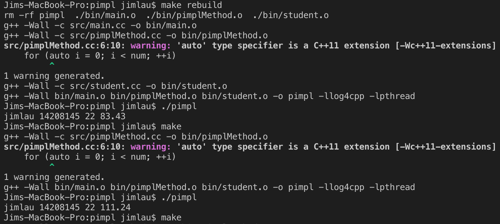
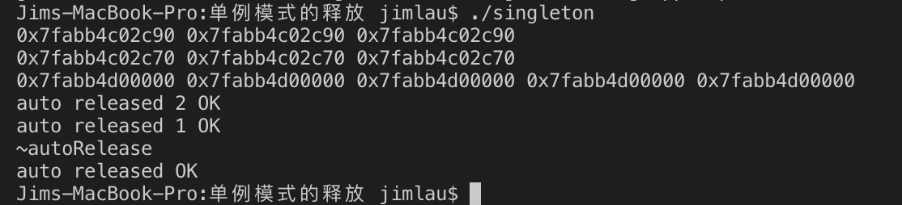

# C++ day8

## 0. 实现PIMPL设计模式模式

```cpp
// "include/student.hxx"
#ifndef __STUDENT_HXX
#define __STUDENT_HXX

#include <iostream>
#include <string>

class student
{
public:
    student(const std::string& name, const int sno, const int age, const double *arr, const int num);
    ~student();
    friend std::ostream& operator<<(std::ostream& os, const student& stu);

private:
    std::string _name;
    int _sno, _age;
    double _avgGrade;
    class pimplMethod;
    pimplMethod* _stu_pimpl;
};
#endif
```

```cpp
// "include/pimpl.hxx"
#ifndef __PIMPL_HXX
#define __PIMPL_HXX

#include "./student.hxx"

/* 定义impl内部实现类，注意要加作用域才行啊！！！ */
class student::pimplMethod
{
public:
    double avgCnt(const double *arr, const int num);
};

#endif
```

```cpp
// "src/student.cc"
#include "../include/pimpl.hxx"
#include "../include/student.hxx"

student::student(const std::string& name, const int sno, const int age, const double *arr, const int num)
: _name(name), _sno(sno), _age(age), _stu_pimpl(new pimplMethod)
{
    _avgGrade = _stu_pimpl->avgCnt(arr, num);
}

student::~student(){delete _stu_pimpl;}

std::ostream& operator<<(std::ostream& os, const student &stu)
{
    os<<stu._name<<' '<<stu._sno<<' '<<stu._age<<' '<<stu._avgGrade;
    return os;
}
```

```cpp
// "src/pimplMethod.cc"
#include "../include/pimpl.hxx"

double student::pimplMethod::avgCnt(const double *arr, const int num)
{
    double sum = 0;
    for (auto i = 0; i < num; ++i)
    {
        sum += arr[i];
    }
    return sum / 4;
}
```

```cpp
// "src/main.cc"
#include "../include/pimpl.hxx"
#include "../include/student.hxx"

int main()
{
    double arr[] = {83.4, 82.32, 83.45, 84.55};
    student jim("jimlau", 14208145, 22, arr, 4);
    std::cout<<jim<<std::endl;
    return 0;
}
```

实现效果：

<div align=center>


</div>

## 1. 实现单例模式的自动释放（3种方式）

```cpp
// "include/singleton.hh"
#ifndef __SINGLETON_HH
#define __SINGLETON_HH

#include <pthread.h>
#include <iostream>

class Singleton1st
{
    class autoRelease
    {
    public:
        ~autoRelease()
        {
            std::cout<<__FUNCTION__<<std::endl;
            if (Singleton1st::_restore == nullptr)
                return;
            delete _restore;
            std::cout<<"auto released OK"<<std::endl;
        }
    };
public:
    static Singleton1st* genObj();

private:
    Singleton1st();
    ~Singleton1st();
    Singleton1st(const Singleton1st&);
    static Singleton1st* _restore;
    char _exam[24];
    static autoRelease _auto;
};

class Singleton2ed
{
public:
    static Singleton2ed* genObj();
    static void destroy();

private:
    Singleton2ed();
    ~Singleton2ed();
    Singleton2ed(const Singleton2ed&);
    static Singleton2ed* _restore;
    char _exam[24];
};

class Singleton3rd
{
public:
    static Singleton3rd* genObj();
    static void destroy();

private:
    static void init();
    Singleton3rd();
    ~Singleton3rd();
    Singleton3rd(const Singleton3rd&);
    static Singleton3rd* _restore;
    char _exam[24];
    static pthread_once_t _once;
};

#endif
```

```cpp
// "src/singleton.cc"
#include <cstring>
#include "../include/singleton.hh"

/* first implementation of autorelease */
Singleton1st::Singleton1st()
:_exam("")
{}

Singleton1st::~Singleton1st()
{}

Singleton1st* Singleton1st::genObj()
{
    if(_restore)
        return _restore;
    _restore = new Singleton1st;
    return _restore;
}

Singleton1st* Singleton1st::_restore = nullptr; //懒汉模式
Singleton1st::autoRelease Singleton1st::_auto;

/* second implementation of autorelease */
Singleton2ed::Singleton2ed()
:_exam("")
{}

Singleton2ed::~Singleton2ed()
{}

Singleton2ed* Singleton2ed::genObj()
{
    if(_restore)
        return _restore;
    _restore = new Singleton2ed;
    ::atexit(Singleton2ed::destroy);
    return _restore;
}

void Singleton2ed::destroy()
{
    if(_restore == nullptr) return;
    std::cout<<"auto released 1 OK"<<std::endl;
    delete _restore;
}

Singleton2ed* Singleton2ed::_restore = Singleton2ed::genObj(); //饿汉模式

/* third implementation of autorelease */
Singleton3rd::Singleton3rd()
:_exam("")
{}

Singleton3rd::~Singleton3rd()
{}

Singleton3rd* Singleton3rd::genObj()
{
    if(_restore)
        return _restore;
    pthread_once(&_once, init);
    return _restore;
}

void Singleton3rd::init()
{
    _restore = new Singleton3rd;
    ::atexit(Singleton3rd::destroy);
}


void Singleton3rd::destroy()
{
    if(_restore == nullptr) return;
    std::cout<<"auto released 2 OK"<<std::endl;
    delete _restore;
}

Singleton3rd* Singleton3rd::_restore = nullptr; //懒汉模式
pthread_once_t Singleton3rd::_once = PTHREAD_ONCE_INIT;
```

```cpp
// "src/main.cc"
#include <unistd.h>
#include <sys/wait.h>
#include "../include/singleton.hh"

void *threadFunc(void *num)
{
    Singleton3rd* p = Singleton3rd::genObj();
    std::cout<<p<<' ';
    return nullptr;
}

int main()
{
    Singleton1st* p1 = Singleton1st::genObj();
    Singleton1st* p2 = Singleton1st::genObj();
    Singleton1st* p3 = Singleton1st::genObj();

    std::cout<<p1<<' '<<p2<<' '<<p3<<' '<<std::endl;

    Singleton2ed* p11 = Singleton2ed::genObj();
    Singleton2ed* p12 = Singleton2ed::genObj();
    Singleton2ed* p13 = Singleton2ed::genObj();

    std::cout<<p11<<' '<<p12<<' '<<p13<<' '<<std::endl;

    pthread_t thid[5];
    for (long int i = 0; i < 5; ++i)
    {
        pthread_create(&thid[i], NULL, threadFunc, (void *)i);
    }
    for (int i = 0; i < 5; ++i)
    {
        pthread_join(thid[i], NULL);
    }

    std::cout<<std::endl;

    return 0;
}
```

实现效果：

<div align=center>


</div>

## 2. 实现基本的COW的CowString


## 3. 实现CowString, 让其operator[]能够区分出读写操作
