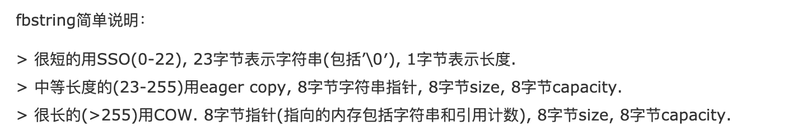
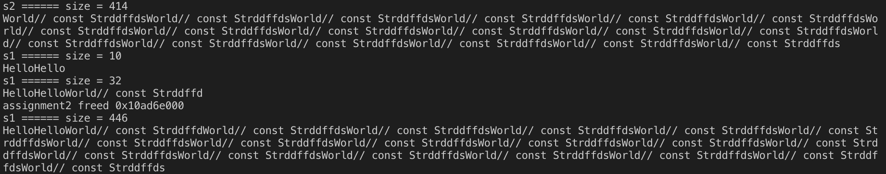
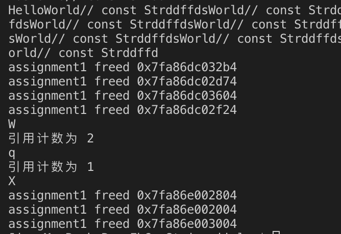

# C++ day8

## 0. 实现PIMPL设计模式模式

```cpp
// "include/student.hxx"
#ifndef __STUDENT_HXX
#define __STUDENT_HXX

#include <iostream>
#include <string>

class student
{
public:
    student(const std::string& name, const int sno, const int age, const double *arr, const int num);
    ~student();
    friend std::ostream& operator<<(std::ostream& os, const student& stu);

private:
    std::string _name;
    int _sno, _age;
    double _avgGrade;
    class pimplMethod;
    pimplMethod* _stu_pimpl;
};
#endif
```

```cpp
// "include/pimpl.hxx"
#ifndef __PIMPL_HXX
#define __PIMPL_HXX

#include "./student.hxx"

/* 定义impl内部实现类，注意要加作用域才行啊！！！ */
class student::pimplMethod
{
public:
    double avgCnt(const double *arr, const int num);
};

#endif
```

```cpp
// "src/student.cc"
#include "../include/pimpl.hxx"
#include "../include/student.hxx"

student::student(const std::string& name, const int sno, const int age, const double *arr, const int num)
: _name(name), _sno(sno), _age(age), _stu_pimpl(new pimplMethod)
{
    _avgGrade = _stu_pimpl->avgCnt(arr, num);
}

student::~student(){delete _stu_pimpl;}

std::ostream& operator<<(std::ostream& os, const student &stu)
{
    os<<stu._name<<' '<<stu._sno<<' '<<stu._age<<' '<<stu._avgGrade;
    return os;
}
```

```cpp
// "src/pimplMethod.cc"
#include "../include/pimpl.hxx"

double student::pimplMethod::avgCnt(const double *arr, const int num)
{
    double sum = 0;
    for (auto i = 0; i < num; ++i)
    {
        sum += arr[i];
    }
    return sum / 4;
}
```

```cpp
// "src/main.cc"
#include "../include/pimpl.hxx"
#include "../include/student.hxx"

int main()
{
    double arr[] = {83.4, 82.32, 83.45, 84.55};
    student jim("jimlau", 14208145, 22, arr, 4);
    std::cout<<jim<<std::endl;
    return 0;
}
```

实现效果：

<div align=center>


</div>

## 1. 实现单例模式的自动释放（3种方式）

```cpp
// "include/singleton.hh"
#ifndef __SINGLETON_HH
#define __SINGLETON_HH

#include <pthread.h>
#include <iostream>

class Singleton1st
{
    class autoRelease
    {
    public:
        ~autoRelease()
        {
            std::cout<<__FUNCTION__<<std::endl;
            if (Singleton1st::_restore == nullptr)
                return;
            delete _restore;
            std::cout<<"auto released OK"<<std::endl;
        }
    };
public:
    static Singleton1st* genObj();

private:
    Singleton1st();
    ~Singleton1st();
    Singleton1st(const Singleton1st&);
    static Singleton1st* _restore;
    char _exam[24];
    static autoRelease _auto;
};

class Singleton2ed
{
public:
    static Singleton2ed* genObj();
    static void destroy();

private:
    Singleton2ed();
    ~Singleton2ed();
    Singleton2ed(const Singleton2ed&);
    static Singleton2ed* _restore;
    char _exam[24];
};

class Singleton3rd
{
public:
    static Singleton3rd* genObj();
    static void destroy();

private:
    static void init();
    Singleton3rd();
    ~Singleton3rd();
    Singleton3rd(const Singleton3rd&);
    static Singleton3rd* _restore;
    char _exam[24];
    static pthread_once_t _once;
};

#endif
```

```cpp
// "src/singleton.cc"
#include <cstring>
#include "../include/singleton.hh"

/* first implementation of autorelease */
Singleton1st::Singleton1st()
:_exam("")
{}

Singleton1st::~Singleton1st()
{}

Singleton1st* Singleton1st::genObj()
{
    if(_restore)
        return _restore;
    _restore = new Singleton1st;
    return _restore;
}

Singleton1st* Singleton1st::_restore = nullptr; //懒汉模式
Singleton1st::autoRelease Singleton1st::_auto;

/* second implementation of autorelease */
Singleton2ed::Singleton2ed()
:_exam("")
{}

Singleton2ed::~Singleton2ed()
{}

Singleton2ed* Singleton2ed::genObj()
{
    if(_restore)
        return _restore;
    _restore = new Singleton2ed;
    ::atexit(Singleton2ed::destroy);
    return _restore;
}

void Singleton2ed::destroy()
{
    if(_restore == nullptr) return;
    std::cout<<"auto released 1 OK"<<std::endl;
    delete _restore;
}

Singleton2ed* Singleton2ed::_restore = Singleton2ed::genObj(); //饿汉模式

/* third implementation of autorelease */
Singleton3rd::Singleton3rd()
:_exam("")
{}

Singleton3rd::~Singleton3rd()
{}

Singleton3rd* Singleton3rd::genObj()
{
    if(_restore)
        return _restore;
    pthread_once(&_once, init);
    return _restore;
}

void Singleton3rd::init()
{
    _restore = new Singleton3rd;
    ::atexit(Singleton3rd::destroy);
}


void Singleton3rd::destroy()
{
    if(_restore == nullptr) return;
    std::cout<<"auto released 2 OK"<<std::endl;
    delete _restore;
}

Singleton3rd* Singleton3rd::_restore = nullptr; //懒汉模式
pthread_once_t Singleton3rd::_once = PTHREAD_ONCE_INIT;
```

```cpp
// "src/main.cc"
#include <unistd.h>
#include <sys/wait.h>
#include "../include/singleton.hh"

void *threadFunc(void *num)
{
    Singleton3rd* p = Singleton3rd::genObj();
    std::cout<<p<<' ';
    return nullptr;
}

int main()
{
    Singleton1st* p1 = Singleton1st::genObj();
    Singleton1st* p2 = Singleton1st::genObj();
    Singleton1st* p3 = Singleton1st::genObj();

    std::cout<<p1<<' '<<p2<<' '<<p3<<' '<<std::endl;

    Singleton2ed* p11 = Singleton2ed::genObj();
    Singleton2ed* p12 = Singleton2ed::genObj();
    Singleton2ed* p13 = Singleton2ed::genObj();

    std::cout<<p11<<' '<<p12<<' '<<p13<<' '<<std::endl;

    pthread_t thid[5];
    for (long int i = 0; i < 5; ++i)
    {
        pthread_create(&thid[i], NULL, threadFunc, (void *)i);
    }
    for (int i = 0; i < 5; ++i)
    {
        pthread_join(thid[i], NULL);
    }

    std::cout<<std::endl;

    return 0;
}
```

实现效果：

<div align=center>


</div>

## 2. 实现基本的COW的CowString

> 以下实现了一个简单的`fbstring`实现，未考虑**线程安全**  

[相关博客链接](https://www.cnblogs.com/cthon/p/9181979.html)


> 使用了`union`进行`SSO`和`COW`，所以可能有`2 bit`的可能性空间，总共**3类**字符串。  

```cpp
// "include/FbStrCOW.hxx"
#include <cstring>
#include <iostream>

namespace fbstr{
    class String
    {
        class charProxy
        {
        public:
            operator char();
            char& operator=(const char &);
            charProxy(String &self, std::size_t index)
            :_self(self), _idx(index)
            {}

        private:
            String& _self;
            std::size_t _idx;
        };
    public:
        String();
        String(const char *);
        String(const String&);
        ~String();
        String &operator=(const String &);
        String &operator=(const char *);

        String &operator+=(const String &);
        String &operator+=(const char *);

        charProxy operator[](std::size_t index);
        const char &operator[](std::size_t index) const;

        std::size_t size() const;
        const char* c_str() const;

        // friend bool operator==(const String &, const String &);
        // friend bool operator!=(const String &, const String &);

        // friend bool operator<(const String &, const String &);
        // friend bool operator>(const String &, const String &);
        // friend bool operator<=(const String &, const String &);
        // friend bool operator>=(const String &, const String &);

        friend std::ostream &operator<<(std::ostream &os, const String &s);
        friend std::istream &operator>>(std::istream &is, String &s);

    private:
        inline void freeProcess();
        inline size_t getLen(const uint8_t type) const;
        inline char * getStr(String &, const uint8_t type);
        inline const char * getStr(const String &, const uint8_t type) const;
        inline uint8_t getType(const String &str) const;
        inline void setSize(const uint8_t type, const size_t length);
        union dataType{
            struct {
                uint8_t _size;
                char _buffer[23];
            }_short;
            struct{
                size_t _size;
                size_t _capacity;
                char * _pstr;
            }_long;
        };
        dataType _dat;
    };

    String operator+(const String &, const String &);
    String operator+(const String &, const char *);
    String operator+(const char *, const String &);

    const int BLOCK_SIZE = 24;

    inline size_t String::getLen(const uint8_t type) const
    {
        return type > 0 ? (_dat._long._size >> 2) : (_dat._short._size >> 2);
    }

    inline char* String::getStr(String &str, const uint8_t type)
    {
        return type > 0 ? str._dat._long._pstr : str._dat._short._buffer;
    }

    inline const char* String::getStr(const String &str, const uint8_t type) const
    {
        return type > 0 ? str._dat._long._pstr : str._dat._short._buffer;
    }

    inline uint8_t String::getType(const String &str) const
    {
        return *(uint8_t *)&str._dat & 3;
    }

    inline void String::setSize(const uint8_t type, const size_t length)
    {
        if(type > 0)
            *(size_t *)&_dat = type | length << 2;
        else
            *(uint8_t *)&_dat = type | length << 2;
    }

    /* 基于三种类型的堆空间释放 */
    inline void String::freeProcess()
    {
        const uint8_t type = getType(*this);
        switch (type)
        {
        case 1:
            if(_dat._long._pstr && --*(int*)(_dat._long._pstr - 4) <= 0){
                delete [](_dat._long._pstr - 4);
#ifndef NDEBUG
                printf("assignment1 freed %p\n", _dat._long._pstr);
#endif
            }
            _dat._long._pstr = nullptr;
            break;
        case 2:
            if(_dat._long._pstr)
                delete []_dat._long._pstr;
#ifndef NDEBUG
            printf("assignment2 freed %p\n", _dat._long._pstr);
#endif
            _dat._long._pstr = nullptr;
            break;
        default:
            break;
        }
    }
} // namespace str
```

```cpp
// "src/FbStringCOW.cc"
#include "../include/FbStrCOW.hxx"
#include <vector>

using std::cout;
using std::cin;
using std::endl;
using std::vector;

namespace fbstr{

    /* 默认构造函数开辟 BLOCK_SIZE = 24 字节的空间 */
    String::String()
    {
        bzero(&_dat, sizeof(_dat));  // 0 代表短字符串
    }

    /* 类型转换构造函数方便传入C风格字符串 */
    /* 0 代表 0 ~ 23 短字符串 */
    /* 1 代表 24 ~ 255 字符串 */
    /* 2 代表 256 ~ 字符串 */
    String::String(const char * str)
    {
        size_t len = strlen(str);
        if(len < 23)
        {
            setSize(0, len);
            strcpy(_dat._short._buffer, str);
        } else if(len > 255) {
            setSize(1, len);
            _dat._long._capacity = len;
            _dat._long._pstr = new char[_dat._long._capacity + 5] + 4;
            *(int*)(_dat._long._pstr - 4) = 1;
            strcpy(_dat._long._pstr, str);
        } else {
            setSize(2, len);
            _dat._long._capacity = len;
            _dat._long._pstr = new char[_dat._long._capacity + 1];
            strcpy(_dat._long._pstr, str);
        }
    }

    /* 简单的复制构造函数 */
    String::String(const String& str)
    {
        memcpy(&this->_dat, &str._dat, sizeof(_dat));
        if(getType(*this) == 1)
            ++*(int*)(_dat._long._pstr - 4);
        else if(getType(str) == 2)
        {
            _dat._long._pstr = new char[_dat._long._capacity + 1];
            strcpy(this -> _dat._long._pstr, str._dat._long._pstr);
        }
    }

    /* 析构函数释放空间 */
    String::~String()
    {
        this->freeProcess();
    }

    /* 赋值重载函数，深拷贝 */
    String& String::operator=(const String &str)
    {
        if(&str == this)
            return *this;

        /* 先释放再拷贝 */
        this->freeProcess();

        const uint8_t type = getType(str);
        memcpy(&_dat, &str._dat, sizeof(_dat));
        switch (type)
        {
        case 1:
            ++*(int*)(_dat._long._pstr - 4);
            break;
        case 2:
            _dat._long._pstr = new char[_dat._long._capacity + 1];
            printf("address = %p\n", _dat._long._pstr);
            strcpy(_dat._long._pstr, str._dat._long._pstr);
            break;
        default:
            break;
        }
        return *this;
    }

    /* 重用以上赋值=、类型转换构造函数函数 */
    String& String::operator=(const char *str)
    {
        *this = String(str);
        return *this;
    }

    /* 拼接字符串 */
    String& String::operator+=(const String &str)
    {
        const uint8_t strType = getType(str), thisType = getType(*this);
        uint8_t type;
        size_t length = str.size() + getLen(thisType);
        char * thisStr = getStr(*this, thisType);
        const char * strStr = getStr(str, strType);

        if(length < 23)
            type = 0;
        else if(length > 255)
            type = 1;
        else
            type = 2;

        switch (type)
        {
        case 0:
        {
            strcat(_dat._short._buffer, str._dat._short._buffer);
            setSize(0, length);
            break;
        }
        case 1:
        {
            if(thisType == 1 && _dat._long._capacity >= length)
            {
                strcat(thisStr, strStr);
                setSize(1, length);
                break;
            }
            char *tmp = new char[length * 2 + 5] + 4;
            sprintf(tmp, "%s%s", thisStr, strStr);
            freeProcess();
            _dat._long._pstr = tmp;
            *(int *)(_dat._long._pstr - 4) = 1;
            setSize(1, length);
            _dat._long._capacity = length * 2;
            break;
        }
        case 2:
        {
            if(thisType > 0 && _dat._long._capacity >= length)
            {
                strcat(thisStr, strStr);
                setSize(2, length);
                break;
            }
  
            size_t capacity = 2 * length > 255 ? 255 : 2 * length;
            char *tmp = new char[_dat._long._capacity];
            sprintf(tmp, "%s%s", thisStr, strStr);
            freeProcess();
            _dat._long._pstr = tmp;
            _dat._long._capacity = capacity;
            setSize(2, length);
            break;
        }
        }
        return *this;
    }

    /* 拼接C风格字符串 */
    String& String::operator+=(const char *str)
    {
        return *this += String(str);
    }

    /* 重载[]方便调用容器中的成员 */
    String::charProxy String::operator[](std::size_t index)
    {
        return charProxy(*this, index);
    }

    /* const风格[]重载 */
    const char &String::operator[](std::size_t index) const
    {
        const char* str = getStr(*this, getType(*this));
        printf("引用计数为 %u\n", *(uint32_t *)(str - 4));
        return str[index];
    }

    /* 查看长度 */
    std::size_t String::size() const
    {
        return getLen(getType(*this));
    }

    /* 传出只读的 C风格字符串 */
    const char* String::c_str() const
    {
        return getStr(*this, getType(*this));
    }

    /* 输出友元函数 */
    std::ostream& operator<<(std::ostream &os, const String &s)
    {
        if(s.getType(s) == 0)
        {
            printf("%s", s._dat._short._buffer);
            return os;
        }
        printf("%s", s._dat._long._pstr);
        return os;
    }

    /* 输入友元函数 */
    std::istream& operator>>(std::istream &is, String &s)
    {
        char ch;
        vector<char> buffer;
        while((ch = is.get()) != '\n' && ch != '\0')
        {
            buffer.push_back(ch);
        }
        buffer.push_back('\0');
        s = &buffer[0];
        return is;
    }

    /* 重载加法函数 */
    String operator+(const String &s1, const String &s2)
    {
        String tmp = s1;
        tmp += s2;
        return tmp;
    }

    /* 重载加法函数 */
    String operator+(const String &s1, const char *s2)
    {
        return s1 + String(s2);
    }

    /* 重载加法函数 */
    String operator+(const char *s1, const String &s2)
    {
        return String(s1) + s2;
    }
}
```

```cpp
// "src/main.cc"
#include "../include/FbStrCOW.hxx"

using std::cout;
using std::cin;
using std::endl;
using namespace fbstr;

int main()
{
    const char *p = "Hello";
    String s1 = p, s3;
    String s2 = "World// const StrddffdsWorld// const StrddffdsWorld// const StrddffdsWorld// const StrddffdsWorld// const StrddffdsWorld// const StrddffdsWorld// const StrddffdsWorld// const StrddffdsWorld// const StrddffdsWorld// const StrddffdsWorld// const StrddffdsWorld// const StrddffdsWorld// const StrddffdsWorld// const StrddffdsWorld// const StrddffdsWorld// const StrddffdsWorld// const StrddffdsWorld// const Strddffds";
    s3 = "World// const Strddffd";
    cout<<"s2 ====== size = "<<s2.size()<<endl;
    cout<<s2<<endl;

    s1 += p;
    cout<<"s1 ====== size = "<<s1.size()<<endl;
    cout<<s1<<endl;
    s1 += s3;
    cout<<"s1 ====== size = "<<s1.size()<<endl;
    cout<<s1<<endl;
    s1 += s2;
    cout<<"s1 ====== size = "<<s1.size()<<endl;
    cout<<s1<<endl;

    cout << p + s2 + s3<<endl;
    s2 += s3 + s1;

    s3 = s2;
    s1 = s2;
    cout << s3[0]<<endl;
    cout<<(s2[0] = 'q')<< endl;
    cout<<(s1[0] = s1[0] + 1) << endl;
    return 0;
}
```

## 3. 实现CowString, 让其operator[]能够区分出读写操作

> `charProxy`代理实现`[]`的读写重载

```cpp
// "src/CharProxyCOW.cc"
#include "../include/FbStrCOW.hxx"

namespace fbstr
{
    String::charProxy::operator char()
    {
        return _self._dat._long._pstr[_idx];
    }

    char& String::charProxy::operator=(const char &ch)
    {
        uint8_t type = _self.getType(_self);
        char* str = _self.getStr(_self, type);
        if(type != 1 || *(uint32_t *)(str - 4) <= 1)
        {
            str[_idx] = ch;
            return str[_idx];
        }

        /* 开始进行引用计数处理 */
        --*(uint32_t *)(str - 4);
        printf("引用计数为 %u\n", *(uint32_t *)(str - 4));
        _self._dat._long._pstr = new char[_self._dat._long._capacity + 5] + 4;
        *(uint32_t *)(_self._dat._long._pstr - 4) = 1;
        strcpy(_self._dat._long._pstr, str);

        _self._dat._long._pstr[_idx] = ch;
        return _self._dat._long._pstr[_idx];
    }
};

```

> 运行结果如下  

<div align=center>



</div>
